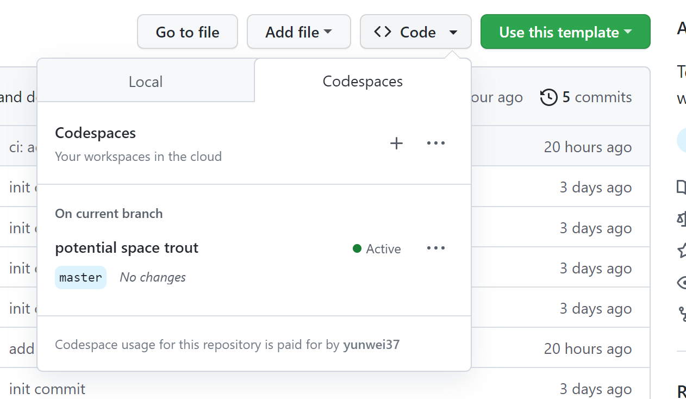
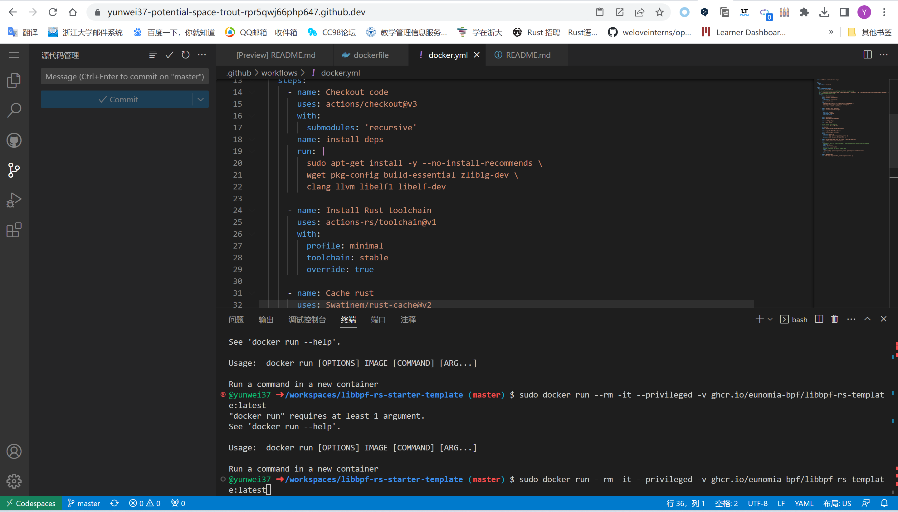
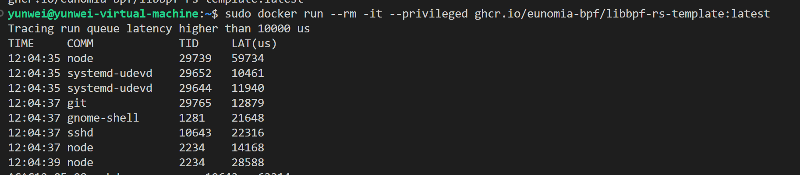
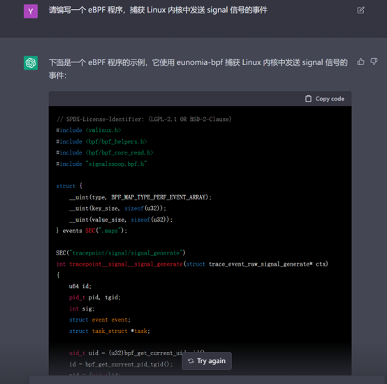

# eBPF 开发者教程与知识库：eBPF Tutorial by Example

[](https://github.com/eunomia-bpf/bpf-developer-tutorial/actions/workflows/test-libbpf.yml)

[GitHub](https://github.com/eunomia-bpf/bpf-developer-tutorial)
[Gitee 镜像](https://gitee.com/yunwei37/bpf-developer-tutorial)
[English Version](README_en.md)

#### [**Check out the English version here**](README.md)

这是一个基于 `CO-RE`（一次编译，到处运行）的 eBPF 的开发教程，提供了从入门到进阶的 eBPF 开发实践，包括基本概念、代码实例、实际应用等内容。和 BCC 不同的是，我们使用 libbpf、Cilium、libbpf-rs、eunomia-bpf 等框架进行开发，包含 C、Go、Rust 等语言的示例。

本教程不会进行复杂的概念讲解和场景介绍，主要希望提供一些 eBPF 小工具的案例（**非常短小，从二十行代码开始入门！**），来帮助 eBPF 应用的开发者快速上手 eBPF 的开发方法和技巧。教程内容可以在目录中找到，每个目录都是一个独立的 eBPF 工具案例。

教程关注于可观测性、网络、安全等等方面的 eBPF 示例。

## 目录

### 入门示例

这一部分包含简单的 eBPF 程序示例和介绍。主要利用 `eunomia-bpf` 框架简化开发，介绍 eBPF 的基本用法和开发流程。

- [lesson 0-introduce](src/0-introduce/README.zh.md) eBPF 示例教程 0：核心概念与工具简介
- [lesson 1-helloworld](src/1-helloworld/README.zh.md) eBPF 入门开发实践教程一：Hello World，基本框架和开发流程
- [lesson 2-kprobe-unlink](src/2-kprobe-unlink/README.zh.md) eBPF 入门开发实践教程二：在 eBPF 中使用 kprobe 监测捕获 unlink 系统调用
- [lesson 3-fentry-unlink](src/3-fentry-unlink/README.zh.md) eBPF 入门开发实践教程三：在 eBPF 中使用 fentry 监测捕获 unlink 系统调用
- [lesson 4-opensnoop](src/4-opensnoop/README.zh.md) eBPF 入门开发实践教程四：在 eBPF 中捕获进程打开文件的系统调用集合，使用全局变量过滤进程 pid
- [lesson 5-uprobe-bashreadline](src/5-uprobe-bashreadline/README.zh.md) eBPF 入门开发实践教程五：在 eBPF 中使用  uprobe 捕获 bash 的 readline 函数调用
- [lesson 6-sigsnoop](src/6-sigsnoop/README.zh.md) eBPF 入门开发实践教程六：捕获进程发送信号的系统调用集合，使用 hash map 保存状态
- [lesson 7-execsnoop](src/7-execsnoop/README.zh.md) eBPF 入门实践教程七：捕获进程执行事件，通过 perf event array 向用户态打印输出
- [lesson 8-exitsnoop](src/8-exitsnoop/README.zh.md) eBPF 入门开发实践教程八：在 eBPF 中使用 exitsnoop 监控进程退出事件，使用 ring buffer 向用户态打印输出
- [lesson 9-runqlat](src/9-runqlat/README.zh.md) eBPF 入门开发实践教程九：捕获进程调度延迟，以直方图方式记录
- [lesson 10-hardirqs](src/10-hardirqs/README.zh.md) eBPF 入门开发实践教程十：在 eBPF 中使用 hardirqs 或 softirqs 捕获中断事件

### 高级文档和示例

我们开始构建完整的 eBPF 项目，主要基于 `libbpf`，并将其与各种应用场景结合起来，以便实际使用。

- [lesson 11-bootstrap](src/11-bootstrap/README.zh.md) eBPF 入门开发实践教程十一：在 eBPF 中使用 libbpf 开发用户态程序并跟踪 exec() 和 exit() 系统调用
- [lesson 12-profile](src/12-profile/README.zh.md) eBPF 入门实践教程十二：使用 eBPF 程序 profile 进行性能分析
- [lesson 13-tcpconnlat](src/13-tcpconnlat/README.zh.md) eBPF入门开发实践教程十三：统计 TCP 连接延时，并使用 libbpf 在用户态处理数据
- [lesson 14-tcpstates](src/14-tcpstates/README.zh.md) eBPF入门实践教程十四：记录 TCP 连接状态与 TCP RTT
- [lesson 15-javagc](src/15-javagc/README.zh.md) eBPF 入门实践教程十五：使用 USDT 捕获用户态 Java GC 事件耗时
- [lesson 16-memleak](src/16-memleak/README.zh.md) eBPF 入门实践教程十六：编写 eBPF 程序 Memleak 监控内存泄漏
- [lesson 17-biopattern](src/17-biopattern/README.zh.md) eBPF 入门实践教程十七：编写 eBPF 程序统计随机/顺序磁盘 I/O
- [lesson 18-further-reading](src/18-further-reading/README.zh.md) 更多的参考资料：论文、项目等等
- [lesson 19-lsm-connect](src/19-lsm-connect/README.zh.md) eBPF 入门实践教程：使用 LSM 进行安全检测防御
- [lesson 20-tc](src/20-tc/README.zh.md) eBPF 入门实践教程二十：使用 eBPF 进行 tc 流量控制
- [lesson 21-xdp](src/21-xdp/README.zh.md) eBPF 入门实践教程二十一： 使用 XDP 进行可编程数据包处理

### 深入主题

这一部分涵盖了与 eBPF 相关的高级主题，包括在 Android 上使用 eBPF 程序、利用 eBPF 程序进行的潜在攻击和防御以及复杂的追踪。结合用户模式和内核模式的 eBPF 可以带来强大的能力（也可能带来安全风险）。

Android:

- [lesson 22-android](src/22-android/README.zh.md) 在 Android 上使用 eBPF 程序
网络:

- [lesson 23-http](src/23-http/README.zh.md) 通过 eBPF socket filter 或 syscall trace 追踪 HTTP 请求等七层协议 - eBPF 实践教程
- [lesson 29-sockops](src/29-sockops/README.zh.md) eBPF 开发实践：使用 sockops 加速网络请求转发
- [lesson 41-xdp-tcpdump](src/41-xdp-tcpdump/README.zh.md) eBPF 示例教程：使用 XDP 捕获 TCP 信息
- [lesson 42-xdp-loadbalancer](src/42-xdp-loadbalancer/README.zh.md) eBPF 开发者教程： 简单的 XDP 负载均衡器
安全:

- [lesson 24-hide](src/24-hide/README.zh.md) eBPF 开发实践：使用 eBPF 隐藏进程或文件信息
- [lesson 25-signal](src/25-signal/README.zh.md) eBPF 入门实践教程：用 bpf_send_signal 发送信号终止恶意进程
- [lesson 26-sudo](src/26-sudo/README.zh.md) 使用 eBPF 添加 sudo 用户
- [lesson 27-replace](src/27-replace/README.zh.md) 使用 eBPF 替换任意程序读取或写入的文本
- [lesson 28-detach](src/28-detach/README.zh.md) 在应用程序退出后运行 eBPF 程序：eBPF 程序的生命周期
- [lesson 34-syscall](src/34-syscall/README.zh.md) eBPF 开发实践：使用 eBPF 修改系统调用参数
调度器:

- [lesson 44-scx-simple](src/44-scx-simple/README.zh.md) None
其他:

- [lesson 35-user-ringbuf](src/35-user-ringbuf/README.zh.md) eBPF开发实践：使用 user ring buffer 向内核异步发送信息
- [lesson 36-userspace-ebpf](src/36-userspace-ebpf/README.zh.md) 用户空间 eBPF 运行时：深度解析与应用实践
- [lesson 38-btf-uprobe](src/38-btf-uprobe/README.zh.md) 借助 eBPF 和 BTF，让用户态也能一次编译、到处运行
- [lesson 43-kfuncs](src/43-kfuncs/README.zh.md) 超越 eBPF 的极限：在内核模块中定义自定义 kfunc

持续更新中...

## 为什么要写这个教程？

在学习 eBPF 的过程中，我们受到了 [bcc python developer tutorial](src/bcc-documents/tutorial_bcc_python_developer.md) 的许多启发和帮助，但从当下的角度出发，使用 libbpf 开发 eBPF 的应用是目前相对更好的选择。但目前似乎很少有基于 libbpf 和 BPF CO-RE 出发的、通过案例和工具介绍 eBPF 开发的教程，因此我们发起了这个项目，采用类似 bcc python developer tutorial 的组织方式，但使用 CO-RE 的 libbpf 进行开发。

本项目主要基于 [libbpf-boostrap](https://github.com/libbpf/libbpf-bootstrap) 和 [eunomia-bpf](https://github.com/eunomia-bpf/eunomia-bpf) 两个框架完成，并使用 eunomia-bpf 帮助简化一部分 libbpf eBPF 用户态代码的编写，让开发者专注于内核态的 eBPF 代码的开发。

> - 我们还提供了一个使用 ChatGPT ，通过自然语言描述即可自动编写 eBPF 程序和追踪 Linux 系统的小工具，可以让您交互式地学习 eBPF 程序：[GPTtrace](https://github.com/eunomia-bpf/GPTtrace)
> - 欢迎在本仓库的 issue 或 discussion 中提出任意关于 eBPF 学习的疑惑和问题，或者实践中遇到的 bug，我们会尽力帮助您解答！

## GitHub 模板：轻松构建 eBPF 项目和开发环境，一键在线编译运行 eBPF 程序

面对创建一个 eBPF 项目，您是否对如何开始搭建环境以及选择编程语言感到困惑？别担心，我们为您准备了一系列 GitHub 模板，以便您快速启动一个全新的eBPF项目。只需在GitHub上点击 `Use this template` 按钮，即可开始使用。

- <https://github.com/eunomia-bpf/libbpf-starter-template>：基于 C 语言和 libbpf 框架的eBPF 项目模板
- <https://github.com/eunomia-bpf/cilium-ebpf-starter-template>：基于 Go 语言和cilium/框架的的 eBPF 项目模板
- <https://github.com/eunomia-bpf/libbpf-rs-starter-template>：基于 Rust 语言和libbpf-rs 框架的 eBPF 项目模板
- <https://github.com/eunomia-bpf/eunomia-template>：基于 C 语言和 eunomia-bpf 框架的eBPF 项目模板

这些启动模板包含以下功能：

- 一个 Makefile，让您可以一键构建项目
- 一个 Dockerfile，用于为您的 eBPF 项目自动创建一个容器化环境并发布到 Github Packages
- GitHub Actions，用于自动化构建、测试和发布流程
- eBPF 开发所需的所有依赖项

> 通过将现有仓库设置为模板，您和其他人可以快速生成具有相同基础结构的新仓库，从而省去了手动创建和配置的繁琐过程。借助 GitHub 模板仓库，开发者可以专注于项目的核心功能和逻辑，而无需为基础设置和结构浪费时间。更多关于模板仓库的信息，请参阅官方文档：<https://docs.github.com/en/repositories/creating-and-managing-repositories/creating-a-template-repository>

当您使用上述 eBPF 项目模板中的一个创建了一个新仓库时，您可以使用 GitHub Codespaces 轻松地设置和启动一个在线开发环境。以下是使用 GitHub Codespaces 编译和运行 eBPF 程序的步骤：

1. 点击您的新仓库中的 Code 按钮，然后选择 Open with Codespaces 选项：

    

2. GitHub 将为您创建一个新的 Codespace，这可能需要几分钟的时间，具体取决于您的网络速度和仓库的大小。
3. 一旦您的 Codespace 启动并准备好使用，您可以打开终端并导航到您的项目目录中。
4. 可以按照对应的仓库中的介绍来编译和运行 eBPF 程序:

    

使用 Codespaces，您可以轻松地创建、管理和共享云端开发环境，从而将您的开发过程加速并使其更具可靠性。您可以在任何地方、任何设备上使用 Codespaces 进行开发，只需要一个具有 Web 浏览器的计算机即可。同时，GitHub Codespaces 还支持预先配置好的环境、自定义开发容器和可定制化的开发体验等功能，以满足您的开发需求。

在 codespace 编写代码，提交后，Github Actions 会进行编译并自动发布容器镜像。接下来，你可以在任何地方使用 docker 一键运行这个 eBPF 程序，例如：

```console
$ sudo docker run --rm -it --privileged ghcr.io/eunomia-bpf/libbpf-rs-template:latest
[sudo] password for xxx: 
Tracing run queue latency higher than 10000 us
TIME     COMM             TID     LAT(us)       
12:09:19 systemd-udevd    30786   18300         
12:09:19 systemd-udevd    30796   21941         
12:09:19 systemd-udevd    30793   10323         
12:09:19 systemd-udevd    30795   14827         
12:09:19 systemd-udevd    30790   17973         
12:09:19 systemd-udevd    30793   12328         
12:09:19 systemd-udevd    30796   28721
```



## 本地编译

本地编译示例如下所示：

```shell
git clone https://github.com/eunomia-bpf/bpf-developer-tutorial.git
cd bpf-developer-tutorial
git submodule update --init --recursive # 同步 submodule 子模块
cd src/24-hide
make
```

## 为什么需要基于 libbpf 和 BPF CO-RE 的教程？

> 历史上，当需要开发一个BPF应用时可以选择BCC 框架，在实现各种用于Tracepoints的BPF程序时需要将BPF程序加载到内核中。BCC提供了内置的Clang编译器，可以在运行时编译BPF代码，并将其定制为符合特定主机内核的程序。这是在不断变化的内核内部下开发可维护的BPF应用程序的唯一方法。在BPF的可移植性和CO-RE一文中详细介绍了为什么会这样，以及为什么BCC是之前唯一的可行方式，此外还解释了为什么 libbpf 是目前比较好的选择。去年，Libbpf的功能和复杂性得到了重大提升，消除了与BCC之间的很多差异(特别是对Tracepoints应用来说)，并增加了很多BCC不支持的新的且强大的特性(如全局变量和BPF skeletons)。
>
> 诚然，BCC会竭尽全力简化BPF开发人员的工作，但有时在获取便利性的同时也增加了问题定位和修复的困难度。用户必须记住其命名规范以及自动生成的用于Tracepoints的结构体，且必须依赖这些代码的重写来读取内核数据和获取kprobe参数。当使用BPF map时，需要编写一个半面向对象的C代码，这与内核中发生的情况并不完全匹配。除此之外，BCC使得用户在用户空间编写了大量样板代码，且需要手动配置最琐碎的部分。
>
> 如上所述，BCC依赖运行时编译，且本身嵌入了庞大的LLVM/Clang库，由于这些原因，BCC与理想的使用有一定差距：
>
> - 编译时的高资源利用率(内存和CPU)，在繁忙的服务器上时有可能干扰主流程。
> - 依赖内核头文件包，不得不在每台目标主机上进行安装。即使这样，如果需要某些没有通过公共头文件暴露的内核内容时，需要将类型定义拷贝黏贴到BPF代码中，通过这种方式达成目的。
> - 即使是很小的编译时错误也只能在运行时被检测到，之后不得不重新编译并重启用户层的应用；这大大影响了开发的迭代时间(并增加了挫败感...)
>
> Libbpf + BPF CO-RE (Compile Once – Run Everywhere) 选择了一个不同的方式，其思想在于将BPF程序视为一个普通的用户空间的程序：仅需要将其编译成一些小的二进制，然后不用经过修改就可以部署到目的主机上。libbpf扮演了BPF程序的加载器，负责配置工作(重定位，加载和校验BPF程序，创建BPF maps，附加到BPF钩子上等)，开发者仅需要关注BPF程序的正确性和性能即可。这种方式使得开销降到了最低，消除了大量依赖，提升了整体开发者的开发体验。
>
> 在API和代码约定方面，libbpf坚持"最少意外"的哲学，即大部分内容都需要明确地阐述：不会隐含任何头文件，也不会重写代码。仅使用简单的C代码和适当的辅助宏即可消除大部分单调的环节。 此外，用户编写的是需要执行的内容，BPF应用程序的结构是一对一的，最终由内核验证并执行。
>
> 参考：[BCC 到libbpf 的转换指南【译】 - 深入浅出eBPF: https://www.ebpf.top/post/bcc-to-libbpf-guid/](https://www.ebpf.top/post/bcc-to-libbpf-guid/)

## eunomia-bpf

[eunomia-bpf](https://github.com/eunomia-bpf/eunomia-bpf) 是一个开源的 eBPF 动态加载运行时和开发工具链，是为了简化 eBPF 程序的开发、构建、分发、运行而设计的，基于 libbpf 的 CO-RE 轻量级开发框架。

使用 eunomia-bpf ，可以：

- 在编写 eBPF 程序或工具时只编写 libbpf 内核态代码，自动获取内核态导出信息；
- 使用 Wasm 进行 eBPF 用户态程序的开发，在 WASM 虚拟机内部控制整个 eBPF 程序的加载和执行，以及处理相关数据；
- eunomia-bpf 可以将预编译的 eBPF 程序打包为通用的 JSON 或 WASM 模块，跨架构和内核版本进行分发，无需重新编译即可动态加载运行。

eunomia-bpf 由一个编译工具链和一个运行时库组成, 对比传统的 BCC、原生 libbpf 等框架，简化了 eBPF 程序的开发流程，在大多数时候只需编写内核态代码，即可轻松构建、打包、发布完整的 eBPF 应用，同时保证内核态 eBPF 代码和主流的 libbpf, libbpfgo, libbpf-rs 等开发框架的兼容性。需要编写用户态代码的时候，也可以借助 Webassembly 实现通过多种语言进行用户态开发。和 bpftrace 等脚本工具相比, eunomia-bpf 保留了类似的便捷性, 同时不仅局限于 trace 方面, 可以用于更多的场景, 如网络、安全等等。

> - eunomia-bpf 项目 Github 地址: <https://github.com/eunomia-bpf/eunomia-bpf>
> - gitee 镜像: <https://gitee.com/anolis/eunomia>

## 让 ChatGPT 来帮助我们

本教程也尝试借助 ChatGPT 来学习编写 eBPF 程序，同时我们尝试教会 ChatGPT 编写 eBPF 程序，大概步骤如下：

1. 告诉它基本的 eBPF 编程相关的常识
2. 告诉它一些案例：hello world，eBPF 程序的基本结构，如何使用 eBPF 程序进行追踪，并且让它开始编写教程
3. 手动调整教程，并纠正代码和文档中的错误
4. 把修改后的代码再喂给 ChatGPT，让它继续学习
5. 尝试让 ChatGPT 自动生成 eBPF 程序和对应的教程文档！例如



完整的对话记录可以在这里找到: [ChatGPT.md](src/ChatGPT.md)

我们也构建了一个命令行工具的 demo ，通过本教程的训练， 让它通过自然语言描述即可自动编写 eBPF 程序，追踪 Linux 系统：<https://github.com/eunomia-bpf/GPTtrace>


