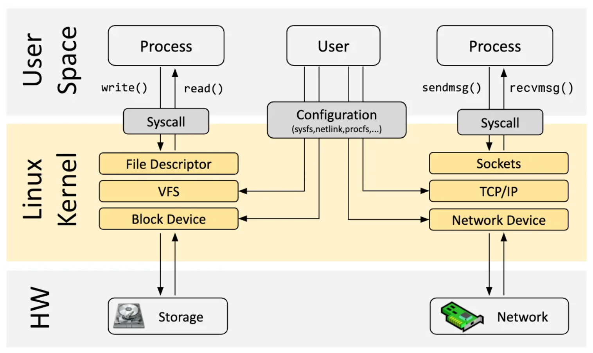

# eBPF Tutorial by Example 0: Introduction to Core Concepts and Tools

## Introduction to eBPF: Secure and Efficient Kernel Extension

eBPF is a revolutionary technology that originated in the Linux kernel and allows sandbox programs to run in the kernel of an operating system. It is used to securely and efficiently extend the functionality of the kernel without the need to modify the kernel's source code or load kernel modules. By allowing the execution of sandbox programs in the operating system, eBPF enables application developers to dynamically add additional functionality to the operating system at runtime. The operating system then ensures security and execution efficiency, similar to performing native compilation with the help of a Just-In-Time (JIT) compiler and verification engine. eBPF programs are portable between kernel versions and can be automatically updated, avoiding workload interruptions and node restarts.

Today, eBPF is widely used in various scenarios: in modern data centers and cloud-native environments, it provides high-performance network packet processing and load balancing; it achieves observability of various fine-grained metrics with very low resource overhead, helping application developers trace applications and provide insights for performance troubleshooting; it ensures secure execution of application and container runtimes, and more. The possibilities are endless, and the innovation unleashed by eBPF in the operating system kernel has only just begun [3].

### The Future of eBPF: Kernel's JavaScript Programmable Interface

For browsers, the introduction of JavaScript brought programmability and initiated a tremendous revolution, transforming browsers into almost independent operating systems. Now let's return to eBPF: in order to understand the programmability impact of eBPF on the Linux kernel, it is helpful to have a high-level understanding of the structure of the Linux kernel and how it interacts with applications and hardware [4].

The main purpose of the Linux kernel is to abstract hardware or virtual hardware and provide a consistent API (system calls) that allows applications to run and share resources. To achieve this goal, we maintain a series of subsystems and layers to distribute these responsibilities [5]. Each subsystem typically allows some level of configuration to cater to different user requirements. If the desired behavior cannot be achieved through configuration, there are two options: either modify the kernel source code and convince the Linux kernel community that the change is necessary (waiting for several years for the new kernel version to become a commodity), or write a kernel module and regularly fix it because each kernel version may break it. In practice, neither of the two solutions is commonly used: the former is too costly, and the latter lacks portability.

With eBPF, there is a new option to reprogram the behavior of the Linux kernel without modifying the kernel's source code or loading kernel modules, while ensuring a certain degree of behavioral consistency, compatibility, and security across different kernel versions [6]. To achieve this, eBPF programs also need a corresponding API that allows the execution and sharing of resources for user-defined applications. In other words, in a sense, the eBPF virtual machine also provides a mechanism similar to system calls. With the help of the communication mechanism between eBPF and user space, both the Wasm virtual machine and user space applications can have full access to this set of "system calls." On the one hand, it can programmatically extend the capabilities of traditional system calls, and on the other hand, it can achieve more efficient programmable IO processing in many layers such as networking and file systems.

As shown in the above figure, the Linux kernel of today is evolving towards a new kernel model: user-defined applications can run in both kernel space and user space, with user space accessing system resources through traditional system calls and kernel space interacting with various parts of the system through BPF Helper Calls. As of early 2023, there are already more than 220 helper system interfaces in the eBPF virtual machine in the kernel, covering a wide range of application scenarios.## Note
It is worth noting that BPF Helper Call and system calls are not competitive. Their programming models and performance advantages are completely different and they do not completely replace each other. For the Wasm and Wasi related ecosystems, the situation is similar. The specially designed wasi interface needs to go through a long standardization process. However, it may provide better performance and portability guarantees for user-mode applications in specific scenarios. On the other hand, eBPF can provide a fast and flexible solution for extending system interfaces, while ensuring sandbox nature and portability.

Currently, eBPF is still in the early stages. However, with the help of the kernel interfaces provided by eBPF and the ability to interact with user space, applications in the Wasm virtual machine can almost access the data and return values of any kernel or user mode function call (kprobe, uprobe...). It can collect and understand all system calls at a low cost and obtain packet-level data and socket-level data for all network operations (tracepoint, socket...). It can also add additional protocol analyzers and easily program any forwarding logic in the network packet processing solution (XDP, TC...), without leaving the packet processing environment of the Linux kernel.

Moreover, eBPF has the ability to write data to any address of a user space process (bpf_probe_write_user[7]), partially modify the return value of a kernel function (bpf_override_return[8]), and even directly execute certain system calls in kernel mode[9]. Fortunately, eBPF performs strict security checks on the bytecode before loading it into the kernel to ensure that there are no operations such as memory out-of-bounds. Moreover, many features that may expand the attack surface and pose security risks need to be explicitly enabled during kernel compilation. Before loading the bytecode into the kernel, the Wasm virtual machine can also choose to enable or disable certain eBPF features to ensure the security of the sandbox.

In addition to the kernel mode eBPF runtime, eBPF can also be extended to user space, for example, [bpftime](https://github.com/eunomia-bpf/bpftime) to achieve higher performance user space tracing, performance analysis, plugins, etc.

## 2. Some Tips on Learning eBPF Development

This article will not provide a more detailed introduction to the principles of eBPF, but here is a learning plan and reference materials that may be of value:

### Introduction to eBPF (5-7h)

- Google or other search engines: eBPF
- Ask ChatGPT-like things: What is eBPF?

Recommended:

- Read the introduction to ebpf: <https://ebpf.io/> (30min)
- Briefly understand the ebpf kernel-related documentation: <https://prototype-kernel.readthedocs.io/en/latest/bpf/> (Know where to queries, 30min)
- Read the Chinese ebpf beginner's guide: <https://www.modb.pro/db/391570> (1h)
- There are a lot of reference materials: <https://github.com/zoidbergwill/awesome-ebpf> (2-3h)
- You can choose to flip through PPTs that interest you: <https://github.com/gojue/ebpf-slide> (1-2h)

Answer three questions:

1. Understand what eBPF is? Why do we need it? Can't we use kernel modules?
2. What functions does it have? What can it do in the Linux kernel? What are the types of eBPF programs and helpers (not all of them need to be known, but need to know where to find them)?
3. What can it be used for? For example, in which scenarios can it be used? Networking, security, observability?

### Understand how to develop eBPF programs (10-15h)

Understand and try eBPF development frameworks:

- bpftrace tutorial：<https://eunomia.dev/tutorials/bpftrace-tutorial/> （Try it，1h）
- Examples of developing various tools with BCC: <https://github.com/iovisor/bcc/blob/master/docs/tutorial_bcc_python_developer.md> (Run through, 3-4h)
- Some examples of libbpf: <https://github.com/libbpf/libbpf-bootstrap> (Run any interesting one and read the source code, 2h)
- Tutorial based on libbpf and eunomia-bpf: <https://github.com/eunomia-bpf/bpf-developer-tutorial> (Read part 1-10, 3-4h)

Other development frameworks: Go or Rust language, please search and try on your own (0-2h)

Have questions or things you want to know, whether or not they are related to this project, you can start discussing in the discussions of this project.

Answer some questions and try some experiments (2-5h):

1. How to develop the simplest eBPF program?
2. How to trace a kernel feature or function with eBPF? There are many ways, provide corresponding code examples;
3. What are the solutions for communication between user mode and kernel mode? How to send information from user mode to kernel mode? How to pass information from kernel mode to user mode? Provide code examples;
4. Write your own eBPF program to implement a feature;
5. In the entire lifecycle of an eBPF program, what does it do in user mode and kernel mode?## 3. How to use eBPF programming

Writing original eBPF programs is very tedious and difficult. To change this situation, llvm introduced in 2015 the ability to compile code written in high-level languages into eBPF bytecode, and the eBPF community wrapped primitive system calls such as `bpf()` and provided the `libbpf` library. These libraries include functions for loading bytecode into the kernel and other key functions. In the Linux source code package, there are numerous eBPF sample codes provided by Linux based on `libbpf`, located in the `samples/bpf/` directory.

A typical `libbpf`-based eBPF program consists of two files: `*_kern.c` and `*_user.c`. The mounting points and processing functions in the kernel are written in `*_kern.c`, while the user code for injecting kernel code and performing various tasks in user space is written in `*_user.c`. For more detailed tutorials, refer to [this video](https://www.bilibili.com/video/BV1f54y1h74r?spm_id_from=333.999.0.0). However, due to the difficulty in understanding and the entry barrier, most eBPF program development at the current stage is based on tools such as:

- BCC
- BPFtrace
- libbpf-bootstrap
- Go eBPF library

And there are newer tools such as `eunomia-bpf`.

## Writing eBPF programs

eBPF programs consist of a kernel space part and a user space part. The kernel space part contains the actual logic of the program, while the user space part is responsible for loading and managing the kernel space part. With the eunomia-bpf development tool, only the kernel space part needs to be written.

The code in the kernel space part needs to conform to the syntax and instruction set of eBPF. eBPF programs mainly consist of several functions, each with its own specific purpose. The available function types include:

- kprobe: probe function, executed before or after a specified kernel function.
- tracepoint: tracepoint function, executed at a specified kernel tracepoint.
- raw_tracepoint: raw tracepoint function, executed at a specified kernel raw tracepoint.
- xdp: network data processing function, intercepting and processing network packets.
- perf_event: performance event function, used to handle kernel performance events.
- kretprobe: return probe function, executed when a specified kernel function returns.
- tracepoint_return: tracepoint return function, executed when a specified kernel tracepoint returns.
- raw_tracepoint_return: raw tracepoint return function, executed when a specified kernel raw tracepoint returns.

### BCC

BCC stands for BPF Compiler Collection. The project is a Python library that includes a complete toolchain for writing, compiling, and loading BPF programs, as well as tools for debugging and diagnosing performance issues.

Since its release in 2015, BCC has been continuously improved by hundreds of contributors and now includes a large number of ready-to-use tracing tools. The [official project repository](https://github.com/iovisor/bcc/blob/master/docs/tutorial.md) provides a handy tutorial for users to quickly get started with BCC.

Users can program in high-level languages such as Python and Lua on BCC. Compared to programming directly in C, these high-level languages are much more convenient. Users only need to design BPF programs in C, and the rest, including compilation, parsing, loading, etc., can be done by BCC.

However, a drawback of using BCC is its compatibility. Each time an eBPF program based on BCC is executed, it needs to be compiled, and compiling requires users to configure related header files and corresponding implementations. In practical applications, as you may have experienced, dependency issues in compilation can be quite tricky. Therefore, in the development of this project, we have abandoned BCC and chosen the libbpf-bootstrap tool, which allows for one-time compilation and multiple runs.

### eBPF Go library

The eBPF Go library provides a general-purpose eBPF library that decouples the process of obtaining eBPF bytecode from the loading and management of eBPF programs, and implements similar CO- functionality as libbpf. eBPF programs are usually created by writing high-level languages and then compiled into eBPF bytecode using the clang/LLVM compiler.

### libbpf

`libbpf-bootstrap` is a BPF development scaffold based on the `libbpf` library, and its source code can be obtained from its [GitHub](https://github.com/libbpf/libbpf-bootstrap).

`libbpf-bootstrap` combines years of practice from the BPF community and provides a modern and convenient workflow for developers, achieving the goal of one-time compilation and reuse.

BPF programs based on `libbpf-bootstrap` have certain naming conventions for the source files. The file for generating kernel space bytecode ends with `.bpf.c`, and the file for loading bytecode in user space ends with `.c`, and the prefixes of these two files must be the same.Instructions: Translate the following Chinese text to English
while maintaining the original formatting: "Based on `libbpf-bootstrap`, BPF programs will compile `*.bpf.c` files into corresponding `.o` files,
and then generate the `skeleton` file based on this file, i.e. `*.skel.h`. This file will contain some data structures defined in the kernel space,
as well as the key functions used to load kernel space code. After the user-space code includes this file, it can call the corresponding loading function to load the bytecode into the kernel. Similarly, `libbpf-bootstrap` also has a comprehensive introduction tutorial that users can refer to [here](https://nakryiko.com/posts/libbpf-bootstrap/) for detailed introductory operations.

### eunomia-bpf

Developing, building, and distributing eBPF has always been a high-threshold task. The use of tools such as BCC and bpftrace has high development efficiency and good portability. However, when it comes to distribution and deployment, it requires the installation of LLVM, Clang, and other compilation environments, and the compilation process needs to be executed locally or remotely every time, resulting in substantial resource consumption. On the other hand, using the native CO-RE libbpf requires writing a considerable amount of user-mode loading code to help properly load eBPF programs and obtain reported information from the kernel. At the same time, there is no good solution for distributing and managing eBPF programs.

[eunomia-bpf](https://github.com/eunomia-bpf/eunomia-bpf) is an open-source eBPF dynamic loading runtime and development toolchain designed to simplify the development, building, distribution, and execution of eBPF programs. It is based on the libbpf CO-RE lightweight development framework.

With eunomia-bpf, you can:

- When writing eBPF programs or tools, only write kernel space code, automatically retrieve kernel space export information, and dynamically load it as a module.
- Use WASM for user space interactive program development to control the loading and execution of the entire eBPF program, as well as the processing of related data inside the WASM virtual machine.
- eunomia-bpf can package pre-compiled eBPF programs into universal JSON or WASM modules for distribution across architectures and kernel versions. They can be dynamically loaded and run without the need for recompilation.

eunomia-bpf consists of a compilation toolchain and a runtime library. Compared with traditional frameworks such as BCC and native libbpf, it greatly simplifies the development process of eBPF programs. In most cases, only writing kernel space code is required to easily build, package, and publish complete eBPF applications. At the same time, kernel space eBPF code ensures 100% compatibility with mainstream development frameworks such as libbpf, libbpfgo, libbpf-rs, etc. When there is a need to write user-space code, it can also be developed in multiple languages with the help of WebAssembly. Compared with script tools such as bpftrace, eunomia-bpf retains similar convenience, while not only limited to tracing but also applicable to more scenarios, such as networking, security, etc.

> - eunomia-bpf project Github address: <https://github.com/eunomia-bpf/eunomia-bpf>
> - gitee mirror: <https://gitee.com/anolis/eunomia>

## References

- eBPF Introduction: <https://ebpf.io/>
- BPF Compiler Collection (BCC): <https://github.com/iovisor/bcc>
- eunomia-bpf: <https://github.com/eunomia-bpf/eunomia-bpf>

You can also visit our tutorial code repository <https://github.com/eunomia-bpf/bpf-developer-tutorial> or website <https://eunomia.dev/tutorials/> for more examples and complete tutorial source code. All content is open source. We will continue to share more content about eBPF development practices to help you better understand and master eBPF technology.".
