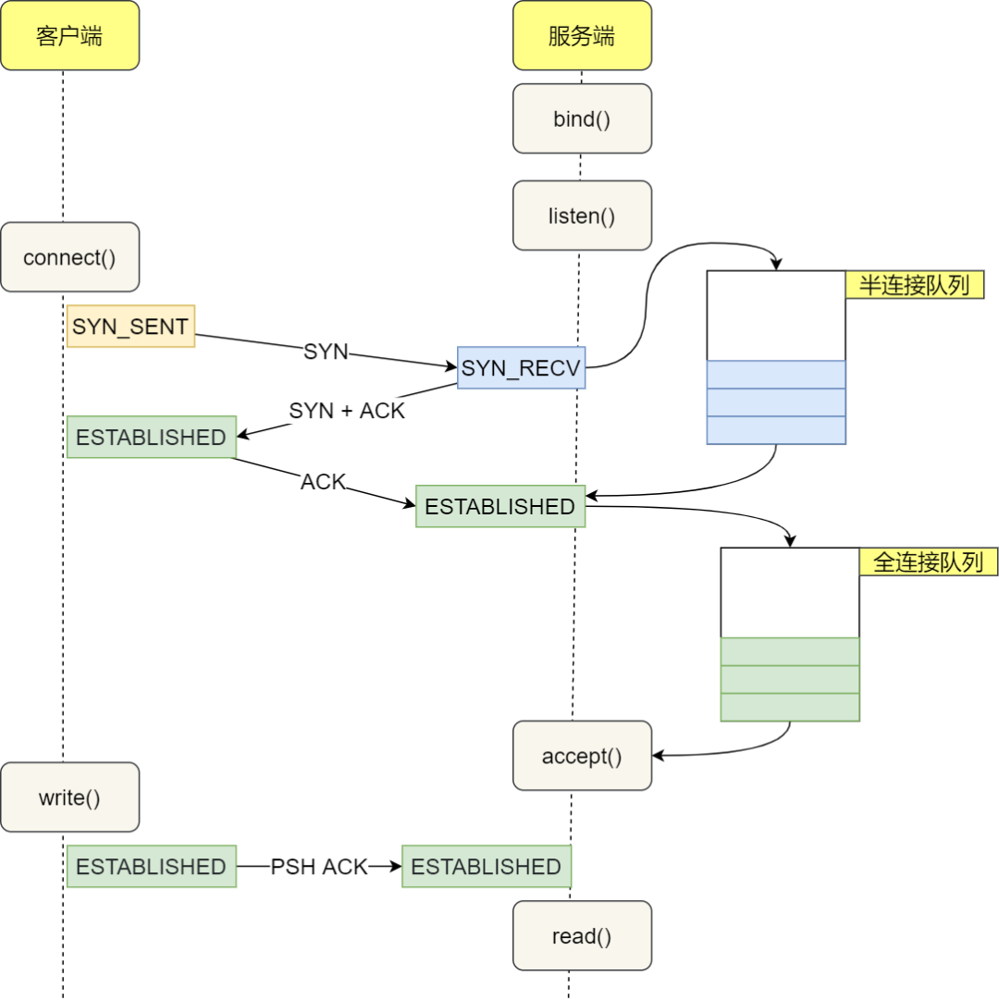

# eBPF Tutorial by Example 13: Statistics of TCP Connection Delay with libbpf

eBPF (Extended Berkeley Packet Filter) is a powerful network and performance analysis tool used in the Linux kernel. eBPF allows developers to dynamically load, update, and run user-defined code without restarting the kernel or changing the kernel source code.

This article is the thirteenth installment of the eBPF Tutorial by Example, mainly about how to use eBPF to statistics TCP connection delay and process data in user space using libbpf.

## Background

When developing backends, regardless of the programming language used, we often need to call databases such as MySQL and Redis, perform RPC remote calls, or call other RESTful APIs. The underlying implementation of these calls is usually based on the TCP protocol. This is because TCP protocol has advantages such as reliable connection, error retransmission, congestion control, etc., so TCP is more widely used in network transport layer protocols than UDP. However, TCP also has some drawbacks, such as longer connection establishment delay. Therefore, some alternative solutions have emerged, such as QUIC (Quick UDP Internet Connections).

Analyzing TCP connection delay is very useful for network performance analysis, optimization, and troubleshooting.

## Overview of tcpconnlat Tool

The `tcpconnlat` tool can trace the functions in the kernel that perform active TCP connections (such as using the `connect()` system call), measure and display connection delay, i.e., the time from sending SYN to receiving response packets.

### TCP Connection Principle

The process of establishing a TCP connection is often referred to as the "three-way handshake". Here are the steps of the entire process:

1. Client sends SYN packet to the server: The client sends SYN through the `connect()` system call. This involves local system call and CPU time cost of software interrupts.
2. SYN packet is transmitted to the server: This is a network transmission that depends on network latency.
3. Server handles the SYN packet: The server kernel receives the packet through a software interrupt, then puts it into the listen queue and sends SYN/ACK response. This mainly involves CPU time cost.
4. SYN/ACK packet is transmitted to the client: This is another network transmission.
5. Client handles the SYN/ACK: The client kernel receives and handles the SYN/ACK packet, then sends ACK. This mainly involves software interrupt handling cost.
6. ACK packet is transmitted to the server: This is the third network transmission.
7. Server receives ACK: The server kernel receives and handles the ACK, then moves the corresponding connection from the listen queue to the established queue. This involves CPU time cost of a software interrupt.
8. Wake up the server-side user process: The user process blocked by the `accept()` system call is awakened, and then the established connection is taken out from the established queue. This involves CPU cost of a context switch.

The complete flowchart is shown below:



From the client's perspective, under normal circumstances, the total time for a TCP connection is approximately the time consumed by one network round-trip. However, in some cases, it may cause an increase in network transmission time, an increase in CPU processing overhead, or even connection failure. When a long delay is detected, it can be analyzed in conjunction with other information.

## eBPF Implementation of tcpconnlat

To understand the process of establishing a TCP connection, we need to understand two queues used by the Linux kernel when handling TCP connections:

- Listen queue (SYN queue): Stores TCP connections that are in the process of performing three-way handshake. After the server receives the SYN packet, it stores the connection information in this queue.
- Established queue (Accept queue): Stores TCP connections that have completed three-way handshake and are waiting for the application to call the `accept()` function. After the server receives the ACK packet, it creates a new connection and adds it to this queue.

With an understanding of the purpose of these two queues, we can begin to explore the specific implementation of tcpconnlat. The implementation of tcpconnlat can be divided into two parts: kernel space and user space, which include several main trace points: `tcp_v4_connect`, `tcp_v6_connect`, and `tcp_rcv_state_process`.

These trace points are mainly located in the TCP/IP network stack in the kernel. When executing the corresponding system call or kernel function, these trace points are activated, triggering the execution of eBPF programs. This allows us to capture and measure the entire process of establishing a TCP connection.

Let's take a look at the source code of these mounting points first:

```c
SEC("kprobe/tcp_v4_connect")
int BPF_KPROBE(tcp_v4_connect, struct sock *sk)
{
 return trace_connect(sk);
}

SEC("kprobe/tcp_v6_connect")
int BPF_KPROBE(tcp_v6_connect, struct sock *sk)
{
  return trace_connect(sk);
}

SEC("kprobe/tcp_rcv_state_process")
int BPF_KPROBE(tcp_rcv_state_process, struct sock *sk)
{
  return handle_tcp_rcv_state_process(ctx, sk);
}
```

This code snippet shows the definition of three kernel probes (kprobe). `tcp_v4_connect` and `tcp_v6_connect` are triggered when the corresponding IPv4 and IPv6 connections are initialized, invoking the `trace_connect()` function. On the other hand, `tcp_rcv_state_process` is triggered when the TCP connection state changes in the kernel, calling the `handle_tcp_rcv_state_process()` function.

The following section will be divided into two parts: one part analyzes the kernel part of these mount points, where we will delve into the kernel source code to explain how these functions work in detail. The other part analyzes the user part, focusing on how eBPF programs collect data from these mount points and interact with user-space programs.

### Analysis of tcp_v4_connect function

The `tcp_v4_connect` function is the main way that the Linux kernel handles TCP IPv4 connection requests. When a user-space program creates a socket through the `socket` system call and then attempts to connect to a remote server through the `connect` system call, the `tcp_v4_connect` function is triggered.

```c
/* This will initiate an outgoing connection. */
int tcp_v4_connect(struct sock *sk, struct sockaddr *uaddr, int addr_len)
{
  struct sockaddr_in *usin = (struct sockaddr_in *)uaddr;
  struct inet_timewait_death_row *tcp_death_row;
  struct inet_sock *inet = inet_sk(sk);
  struct tcp_sock *tp = tcp_sk(sk);
  struct ip_options_rcu *inet_opt;
  struct net *net = sock_net(sk);
  __be16 orig_sport, orig_dport;
  __be32 daddr, nexthop;
  struct flowi4 *fl4;
  struct rtable *rt;
  int err;

  if (addr_len < sizeof(struct sockaddr_in))
    return -EINVAL;

  if (usin->sin_family != AF_INET)
    return -EAFNOSUPPORT;

  nexthop = daddr = usin->sin_addr.s_addr;
  inet_opt = rcu_dereference_protected(inet->inet_opt,
               lockdep_sock_is_held(sk));
  if (inet_opt && inet_opt->opt.srr) {
    if (!daddr)
      return -EINVAL;
    nexthop = inet_opt->opt.faddr;
  }

  orig_sport = inet->inet_sport;
  orig_dport = usin->sin_port;
  fl4 = &inet->cork.fl.u.ip4;
  rt = ip_route_connect(fl4, nexthop, inet->inet_saddr,
            sk->sk_bound_dev_if, IPPROTO_TCP, orig_sport,
            orig_dport, sk);
  if (IS_ERR(rt)) {
    err = PTR_ERR(rt);
    if (err == -ENETUNREACH)
      IP_INC_STATS(net, IPSTATS_MIB_OUTNOROUTES);
    return err;
  }

  if (rt->rt_flags & (RTCF_MULTICAST | RTCF_BROADCAST)) {
    ip_rt_put(rt);
    return -ENETUNREACH;
  }
  if (!inet_opt || !inet_opt->opt.srr)
    daddr = fl4->daddr;

  tcp_death_row = &sock_net(sk)->ipv4.tcp_death_row;

  if (!inet->inet_saddr) {
    err = inet_bhash2_update_saddr(sk,  &fl4->saddr, AF_INET);
    if (err) {
      ip_rt_put(rt);
      return err;
    }
  } else {
    sk_rcv_saddr_set(sk, inet->inet_saddr);
  }

  if (tp->rx_opt.ts_recent_stamp && inet->inet_daddr != daddr) {
    /* Reset inherited state */
    tp->rx_opt.ts_recent    = 0;
    tp->rx_opt.ts_recent_stamp = 0;
    if (likely(!tp->repair))
      WRITE_ONCE(tp->write_seq, 0);
  }

  inet->inet_dport = usin->sin_port;
  sk_daddr_set(sk, daddr);

  inet_csk(sk)->icsk_ext_hdr_len = 0;
  if (inet_opt)
    inet_csk(sk)->icsk_ext_hdr_len = inet_opt->opt.optlen;

  tp->rx_opt.mss_clamp = TCP_MSS_DEFAULT;

  /* Socket identity is still unknown (sport may be zero).
   * However we set state to SYN-SENT and not releasing socket
   * lock select source port, enter ourselves into the hash tables and
   * complete initialization after this.
   */
  tcp_set_state(sk, TCP_SYN_SENT);
  err = inet_hash_connect(tcp_death_row, sk);
  if (err)
    goto failure;

  sk_set_txhash(sk);

  rt = ip_route_newports(fl4, rt, orig_sport, orig_dport,
             inet->inet_sport, inet->inet_dport, sk);
  if (IS_ERR(rt)) {
    err = PTR_ERR(rt);
    rt = NULL;
    goto failure;
  }
  /* OK, now commit destination to socket.  */
  sk->sk_gso_type = SKB_GSO_TCPV4;
  sk_setup_caps(sk, &rt->dst);
  rt = NULL;

  if (likely(!tp->repair)) {
    if (!tp->write_seq)
      WRITE_ONCE(tp->write_seq,
           secure_tcp_seq(inet->inet_saddr,
              inet->inet_daddr,
              inet->inet_sport,
              usin->sin_port));
    tp->tsoffset = secure_tcp_ts_off(net, inet->inet_saddr,
             inet->inet_daddr);
  }

  inet->inet_id = get_random_u16();

  if (tcp_fastopen_defer_connect(sk, &err))
    return err;
  if (err)
    goto failure;

  err = tcp_connect(sk);

  if (err)
    goto failure;

  return 0;

failure:
  /*".* This unhashes the socket and releases the local port,
  * if necessary.
  */
 tcp_set_state(sk, TCP_CLOSE);
 inet_bhash2_reset_saddr(sk);
 ip_rt_put(rt);
 sk->sk_route_caps = 0;
 inet->inet_dport = 0;
 return err;
}
EXPORT_SYMBOL(tcp_v4_connect);
```

Reference link: <https://elixir.bootlin.com/linux/latest/source/net/ipv4/tcp_ipv4.c#L340>

Next, let's analyze this function step by step:

First, this function takes three parameters: a socket pointer `sk`, a pointer to the socket address structure `uaddr`, and the length of the address `addr_len`.

```c
int tcp_v4_connect(struct sock *sk, struct sockaddr *uaddr, int addr_len)
```

The function starts by checking the parameters, making sure the address length is correct and the address family is IPv4. If these conditions are not met, the function returns an error.

Next, the function retrieves the destination address and, if a source routing option is set (an advanced IP feature that is typically not used), it also retrieves the next hop address for the source route.

```c
nexthop = daddr = usin->sin_addr.s_addr;
inet_opt = rcu_dereference_protected(inet->inet_opt,
         lockdep_sock_is_held(sk));
if (inet_opt && inet_opt->opt.srr) {
  if (!daddr)
    return -EINVAL;
  nexthop = inet_opt->opt.faddr;
}
```

Then, using this information, the function looks for a route entry to the destination address. If a route entry cannot be found or the route entry points to a multicast or broadcast address, the function returns an error.

Next, it updates the source address, handles the state of some TCP timestamp options, and sets the destination port and address. After that, it updates some other socket and TCP options and sets the connection state to `SYN-SENT`.

Then, the function tries to add the socket to the connected sockets hash table using the `inet_hash_connect` function. If this step fails, it restores the socket state and returns an error.

If all the previous steps succeed, it then updates the route entry with the new source and destination ports. If this step fails, it cleans up resources and returns an error.

Next, it commits the destination information to the socket and selects a secure random value for the sequence offset for future segments.

Then, the function tries to establish the connection using TCP Fast Open (TFO), and if TFO is not available or the TFO attempt fails, it falls back to the regular TCP three-way handshake for connection.

Finally, if all the above steps succeed, the function returns success; otherwise, it cleans up all resources and returns an error.

In summary, the `tcp_v4_connect` function is a complex function that handles TCP connection requests. It handles many cases, including parameter checking, route lookup, source address selection, source routing, TCP option handling, TCP Fast Open, and more. Its main goal is to establish TCP connections as safely and efficiently as possible.

### Kernel Code

```c
// SPDX-License-Identifier: GPL-2.0
// Copyright (c) 2020 Wenbo Zhang
#include <vmlinux.h>
#include <bpf/bpf_helpers.h>
#include <bpf/bpf_core_read.h>
#include <bpf/bpf_tracing.h>
#include "tcpconnlat.h"

#define AF_INET    2
#define AF_INET6   10

const volatile __u64 targ_min_us = 0;
const volatile pid_t targ_tgid = 0;

struct piddata {
  char comm[TASK_COMM_LEN];
  u64 ts;
  u32 tgid;
};

struct {
  __uint(type, BPF_MAP_TYPE_HASH);
  __uint(max_entries, 4096);
  __type(key, struct sock *);
  __type(value, struct piddata);
} start SEC(".maps");

struct {
  __uint(type, BPF_MAP_TYPE_PERF_EVENT_ARRAY);
  __uint(key_size, sizeof(u32));
  __uint(value_size, sizeof(u32));
} events SEC(".maps");

static int trace_connect(struct sock *sk)
{
  u32 tgid = bpf_get_current_pid_tgid() >> 32;
  struct piddata piddata = {};

  if (targ_tgid && targ_tgid != tgid)
    return 0;

  bpf_get_current_comm(&piddata.comm, sizeof(piddata.comm));
  piddata.ts = bpf_ktime_get_ns();
  piddata.tgid = tgid;
  bpf_map_update_elem(&start, &sk, &piddata, 0);
  return 0;
}

static int handle_tcp_rcv_state_process(void *ctx, struct sock *sk)
{
  struct piddata *piddatap;
  struct event event = {};
  s64 delta;
  u64 ts;

  if (BPF_CORE_READ(sk, __sk_common.skc_state) != TCP_SYN_SENT)
    return 0;

  piddatap = bpf_map_lookup_elem(&start, &sk);
  if (!piddatap)
    return 0;

  ts = bpf_ktime_get_ns();
  delta = (s64)(ts - piddatap->ts);
  if (delta < 0)
    goto cleanup;

  event.delta_us = delta / 1000U;
  if (targ_min_us && event.delta_us < targ_min_us)
    goto cleanup;
  __builtin_memcpy(&event.comm, piddatap->comm,
      sizeof(event.comm));
  event.ts_us = ts / 1000;
  event.tgid = piddatap->tgid;
  event.lport = BPF_CORE_READ(sk, __sk_common.skc_num);
  event.dport = BPF_CORE_READ(sk, __sk_common.skc_dport);
  event.af = BPF_CORE_READ(sk, __sk_common.skc_family);
  if (event.af == AF_INET) {
    event.saddr_v4 = BPF_CORE_READ(sk, __sk_common.skc_rcv_saddr);
    event.daddr_v4 = BPF_CORE_READ(sk, __sk_common.skc_daddr);
  } else {
    BPF_CORE_READ_INTO(&event.saddr_v6, sk,
        __sk_common.skc_v6_rcv_saddr.in6_u.u6_addr32);
    BPF_CORE_READ_INTO(&event.daddr_v6, sk,
        __sk_common.skc_v6_daddr.in6_u.u6_addr32);
  }
  bpf_perf_event_output(ctx, &events, BPF_F_CURRENT_CPU,
      &event, sizeof(event));

cleanup:
  bpf_map_delete_elem(&start, &sk);
  return 0;
}

SEC("kprobe/tcp_v4_connect")
int BPF_KPROBE(tcp_v4_connect, struct sock *sk)
{
  return trace_connect(sk);
}

SEC("kprobe/tcp_v6_connect")
int BPF_KPROBE(tcp_v6_connect, struct sock *sk)
{
  return trace_connect(sk);
}

SEC("kprobe/tcp_rcv_state_process")
int BPF_KPROBE(tcp_rcv_state_process, struct sock *sk)
{
  return handle_tcp_rcv_state_process(ctx, sk);
}

SEC("fentry/tcp_v4_connect")
int BPF_PROG(fentry_tcp_v4_connect, struct sock *sk)
{
  return trace_connect(sk);
}

SEC("fentry/tcp_v6_connect")
int BPF_PROG(fentry_tcp_v6_connect, struct sock *sk)
{
  return trace_connect(sk);
}

SEC("fentry/tcp_rcv_state_process")
int BPF_PROG(fentry_tcp_rcv_state_process, struct sock *sk)
{
  return handle_tcp_rcv_state_process(ctx, sk);
}

char LICENSE[] SEC("license") = "GPL";
```

This eBPF (Extended Berkeley Packet Filter) program is mainly used to monitor and collect the time it takes to establish TCP connections, i.e., the time interval from initiating a TCP connection request (connect system call) to the completion of the connection establishment (SYN-ACK handshake process). This is very useful for monitoring network latency, service performance analysis, and other aspects.

First, two eBPF maps are defined: `start` and `events`. `start` is a hash table used to store the process information and timestamp of the initiating connection request, while `events` is a map of type `PERF_EVENT_ARRAY` used to transfer event data to user space.

```c
struct {
  __uint(type, BPF_MAP_TYPE_HASH);
  __uint(max_entries, 4096);
  __type(key, struct sock *);
  __type(value, struct piddata);
} start SEC(".maps");

struct {
  __uint(type, BPF_MAP_TYPE_PERF_EVENT_ARRAY);
  __uint(key_size, sizeof(u32));
  __uint(value_size, sizeof(u32));
} events SEC(".maps");
```

In the kprobe handling functions `trace_connect` of `tcp_v4_connect` and `tcp_v6_connect`, the process information (process name, process ID, and current timestamp) of the initiating connection request is recorded and stored in the `start` map with the socket structure as the key.

```c
static int trace_connect(struct sock *sk)
{
  u32 tgid = bpf_get_current_pid_tgid() >> 32;
  struct piddata piddata = {};

  if (targ_tgid && targ_tgid != tgid)
    return 0;

  bpf_get_current_comm(&piddata.comm, sizeof(piddata.comm));
  piddata.ts = bpf_ktime_get_ns();
  piddata.tgid = tgid;
  bpf_map_update_elem(&start, &sk, &piddata, 0);
  return 0;
}
```

When the TCP state machine processes the SYN-ACK packet, i.e., when the connection is established, the kprobe handling function `handle_tcp_rcv_state_process` of `tcp_rcv_state_process` is triggered. In this function, it first checks if the socket state is `SYN-SENT`. If it is, it looks up the process information for the socket in the `start` map. Then it calculates the time interval from the initiation of the connection to the present and sends this time interval, process information, and TCP connection details (source port, destination port, source IP, destination IP, etc.) as an event to user space using the `bpf_perf_event_output` function.

```c
static int handle_tcp_rcv_state_process(void *ctx, struct sock *sk)
{
  struct piddata *piddatap;
  struct event event = {};
  s64 delta;
  u64 ts;

  if (BPF_CORE_READ(sk, __sk_common.skc_state) != TCP_SYN_SENT)
    return 0;

  piddatap = bpf_map_lookup_elem(&start, &sk);
  if (!piddatap)
    return 0;

  ts = bpf_ktime_get_ns();
  delta = (s64)(ts - piddatap->ts);
  if (delta < 0)
    goto cleanup;

  event.delta_us = delta / 1000U;
  if (targ_min_us && event.delta_us < targ_min_us)
    goto cleanup;
  __builtin_memcpy(&event.comm, piddatap->comm,
      sizeof(event.comm));
  event.ts_us = ts / 1000;
  event.tgid = piddatap->tgid;
  event.lport = BPF_CORE_READ(sk, __sk_common.skc_num);
  event.dport = BPF_CORE_READ(sk, __sk_common.skc_dport);
  event.af = BPF_CORE_READ(sk, __sk_common.skc_family);
  if (event.af == AF_INET) {
    event.saddr_v4 = BPF_CORE_READ(sk, __sk_common.skc_rcv_saddr);
    event.daddr_v4 = BPF_CORE_READ(sk, __sk_common.skc_daddr);
  } else {
    BPF_CORE_READ_INTO(&event.saddr_v6, sk,
        __sk_common.skc_v6_rcv_saddr.in6_u.u6_addr32);
    BPF_CORE_READ_INTO(&event.daddr_v6, sk,
        __sk_common.skc_v6_daddr.in6_u.u6_addr32);
  }
  bpf_perf_event_output(ctx, &events, BPF_F_CURRENT_CPU,
      &event, sizeof(event));

cleanup:
  bpf_map_delete_elem(&start, &sk);
  return 0;
}
```

This program uses a while loop to repeatedly poll the perf event buffer. If there is an error during polling (e.g., due to a signal interruption), an error message will be printed. This polling process continues until an exit flag `exiting` is received.

Next, let's take a look at the `handle_event` function, which handles every eBPF event sent from the kernel to user space:

```c
void handle_event(void* ctx, int cpu, void* data, __u32 data_sz) {
    const struct event* e = data;
    char src[INET6_ADDRSTRLEN];
    char dst[INET6_ADDRSTRLEN];
    union {
        struct in_addr x4;
        struct in6_addr x6;
    } s, d;
    static __u64 start_ts;

    if (env.timestamp) {
        if (start_ts == 0)
            start_ts = e->ts_us;
        printf("%-9.3f ", (e->ts_us - start_ts) / 1000000.0);
    }
    if (e->af == AF_INET) {
        s.x4.s_addr = e->saddr_v4;
        d.x4.s_addr = e->daddr_v4;
    } else if (e->af == AF_INET6) {
        memcpy(&s.x6.s6_addr, e->saddr_v6, sizeof(s.x6.s6_addr));
        memcpy(&d.x6.s6_addr, e->daddr_v6, sizeof(d.x6.s6_addr));
    } else {
        fprintf(stderr, "broken event: event->af=%d", e->af);
        return;
    }

    if (env.lport) {
        printf("%-6d %-12.12s %-2d %-16s %-6d %-16s %-5d %.2f\n", e->tgid,
               e->comm, e->af == AF_INET ? 4 : 6,
               inet_ntop(e->af, &s, src, sizeof(src)), e->lport,
               inet_ntop(e->af, &d, dst, sizeof(dst)), ntohs(e->dport),
               e->delta_us / 1000.0);
    } else {
        printf("%-6d %-12.12s %-2d %-16s %-16s %-5d %.2f\n", e->tgid, e->comm,
               e->af == AF_INET ? 4 : 6, inet_ntop(e->af, &s, src, sizeof(src)),
               inet_ntop(e->af, &d, dst, sizeof(dst)), ntohs(e->dport),
               e->delta_us / 1000.0);
    }
}
```

The `handle_event` function takes arguments including the CPU number, a pointer to the data, and the size of the data. The data is a `event` structure that contains information about TCP connections computed in the kernel space.

First, it compares the timestamp of the received event with the start timestamp (if available) to calculate the relative time of the event, and then prints it. Next, it converts the source address and destination address from network byte order to host byte order based on the IP address type (IPv4 or IPv6).

Finally, depending on whether the user chooses to display the local port, it prints the process ID, process name, IP version, source IP address, local port (if available), destination IP address, destination port, and connection establishment time. This connection establishment time is calculated in the eBPF program running in the kernel space and sent to the user space.

## Compilation and Execution

```console
$ make
...
  BPF      .output/tcpconnlat.bpf.o".GEN-SKEL .output/tcpconnlat.skel.h
  CC       .output/tcpconnlat.o
  BINARY   tcpconnlat
$ sudo ./tcpconnlat 
PID    COMM         IP SADDR            DADDR            DPORT LAT(ms)
222564 wget         4  192.168.88.15    110.242.68.3     80    25.29
222684 wget         4  192.168.88.15    167.179.101.42   443   246.76
222726 ssh          4  192.168.88.15    167.179.101.42   22    241.17
222774 ssh          4  192.168.88.15    1.15.149.151     22    25.31
```

Source code: [https://github.com/eunomia-bpf/bpf-developer-tutorial/tree/main/src/13-tcpconnlat](https://github.com/eunomia-bpf/bpf-developer-tutorial/tree/main/src/13-tcpconnlat)

References:

- [tcpconnlat](https://github.com/iovisor/bcc/blob/master/libbpf-tools/tcpconnlat.c) in bcc

## Summary

In this eBPF introductory tutorial, we learned how to use eBPF to track and measure the latency of TCP connections. We first explored how eBPF programs can attach to specific kernel functions in kernel-space and capture the start and end times of connection establishment to calculate latency.

We also learned how to use BPF maps to store and retrieve data in kernel-space, enabling data sharing among different parts of the eBPF program. Additionally, we discussed how to use perf events to send data from kernel-space to user-space for further processing and display.

In user-space, we introduced the usage of libbpf library APIs, such as perf_buffer__poll, to receive and process data sent from the kernel-space. We also demonstrated how to parse and print this data in a human-readable format.

If you are interested in learning more about eBPF and its practical applications, please refer to the official documentation of eunomia-bpf: [https://github.com/eunomia-bpf/eunomia-bpf](https://github.com/eunomia-bpf/eunomia-bpf). You can also visit our tutorial code repository at [https://github.com/eunomia-bpf/bpf-developer-tutorial](https://github.com/eunomia-bpf/bpf-developer-tutorial) for more examples and complete tutorials.

In the upcoming tutorials, we will dive deeper into advanced features of eBPF, such as tracing the path of network packets and fine-grained system performance monitoring. We will continue to share more content on eBPF development practices to help you better understand and master eBPF technology. We hope these resources will be valuable in your learning and practical journey with eBPF.

> The original link of this article: <https://eunomia.dev/tutorials/13-tcpconnect>
