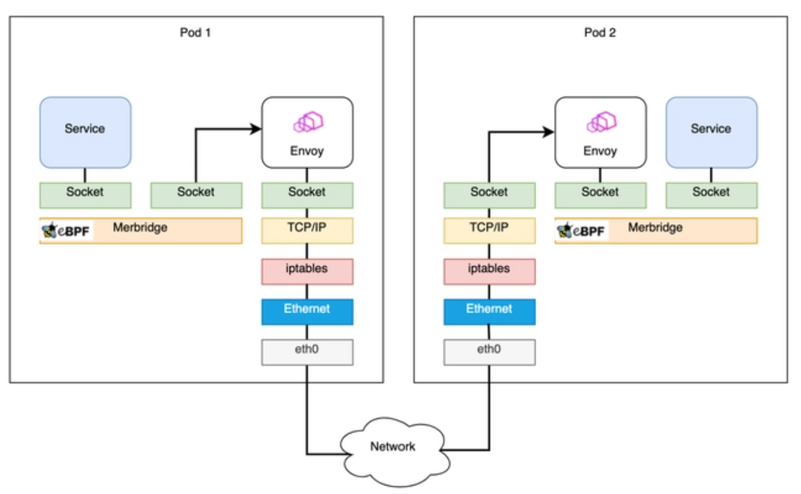

# eBPF Development Practices: Accelerating Network Request Forwarding with Sockops

eBPF (Extended Berkeley Packet Filter) is a powerful feature in the Linux kernel that allows running, loading, and updating user-defined code without the need to modify the kernel source code or reboot the kernel. This capability makes eBPF widely used in various areas such as network and system performance analysis, packet filtering, security policies, etc.

This tutorial will focus on the application of eBPF in the networking domain, specifically how to use sockops-type eBPF programs to accelerate the forwarding of local network requests. This application is often valuable in scenarios where software load balancers are used for request forwarding, such as using tools like Nginx or HAProxy.

In many workloads, such as inter-service communication in a microservices architecture, the performance overhead of network requests made through the loopback interface can significantly impact the overall application performance. Since these requests have to go through the local network stack, their processing performance can become a bottleneck, especially in high-concurrency scenarios. To address this issue, sockops-type eBPF programs can be used to accelerate local request forwarding, providing functionality similar to direct memory access (DMA). Sockops programs can manage sockets in the kernel space and directly forward packets between sockets on the local machine, reducing the CPU time required for packet forwarding in the TCP/IP stack.

This tutorial will demonstrate how to use sockops-type eBPF programs to accelerate network request forwarding through a specific example. To help you understand how to use sockops programs, we will step by step introduce the code of the example program and discuss the working principle of each part. The complete source code and project can be found at <https://github.com/eunomia-bpf/bpf-developer-tutorial/tree/main/src/29-sockops>.

## Leveraging eBPF Sockops for Performance Optimization

Network connections are essentially communication between sockets, and eBPF provides a `bpf_msg_redirect_hash` function that allows packets sent by an application to be directly forwarded to the corresponding socket on the recipient side, greatly accelerating the packet processing flow in the kernel.

Here, the `sock_map` is a key component that stores socket rules, i.e., it selects an existing socket connection from the `sock_map` based on the current packet information. Therefore, it is necessary to save the socket information to the `sock_map` at the hook of the sockops or elsewhere and provide a rule (usually a four-tuple) to find the socket based on the key.

The Merbridge project has achieved acceleration for Istio by replacing iptables with eBPF. After using Merbridge (eBPF) optimization, the inbound and outbound traffic bypasses many kernel modules, significantly improving performance, as shown in the following diagram:



## Example Program

This example program redirects traffic from the sender’s socket (outgoing) to the recipient’s socket (incoming), bypassing the TCP/IP kernel network stack. In this example, we assume that the sender and recipient are both running on the **same** machine. This example program has two parts that share a map definition:

bpf_sockmap.h

```c
#include "vmlinux.h"
#include <bpf/bpf_endian.h>
#include <bpf/bpf_helpers.h>

#define LOCALHOST_IPV4 16777343

struct sock_key {
    __u32 sip;
    __u32 dip;
    __u32 sport;
    __u32 dport;
    __u32 family;
};

struct {
 __uint(type, BPF_MAP_TYPE_SOCKHASH);
 __uint(max_entries, 65535);
 __type(key, struct sock_key);
 __type(value, int);
} sock_ops_map SEC(".maps");
```

The BPF program in this example is divided into two parts: `bpf_redirect.bpf.c` and `bpf_contrack.bpf.c`.

- The BPF code in `bpf_contrack.bpf.c` defines a socket operation (`sockops`) program, whose main function is to create an entry in the `sock_ops_map` BPF map in which it stores the five-tuple (source address, destination address, source port, destination port, protocol) for each new TCP connection established on the local machine (using localhost). This BPF map is defined as type `BPF_MAP_TYPE_SOCKHASH` and can store sockets and their corresponding five-tuple. This allows the five-tuple information of each local TCP connection to be found in the BPF map whenever the connection is created.

- The BPF code in `bpf_redirect.bpf.c` defines a sk_msg handler that is called when a message arrives on a local socket. The sk_msg program checks if the message is from a local address, and if so, it retrieves the five-tuple (source address, destination address, source port, destination port, protocol) from the message and looks up the corresponding socket in the `sock_ops_map` using the obtained key. Then, it redirects the message to the socket found in the `sock_ops_map`, thus bypassing the kernel network stack and directly delivering the message from the sender's socket to the receiver's socket.

For example, let's assume that there are two processes running locally, process A binds to port 8000, and process B binds to port 9000. Process A sends a message to process B.

1. When the TCP connection is first established between process A and process B, the `sockops` program in `bpf_contrack.bpf.c` is triggered, and it creates an entry in the `sock_ops_map` BPF map for the five-tuple `{127.0.0.1, 127.0.0.1, 8000, 9000, TCP}`, with the value being the socket of process A.

2. When process A sends a message, the `sk_msg` program in `bpf_redirect.bpf.c` is triggered, and it redirects the message from process A's socket to the socket stored in the `sock_ops_map` based on the obtained five-tuple information (source address, destination address, source port, destination port, protocol). As a result, the message is directly delivered from process A to process B, bypassing the kernel network stack.

This example program uses BPF to efficiently redirect messages from the sender's socket to the recipient's socket during local communication, bypassing the kernel network stack to improve transmission efficiency.

bpf_redirect.bpf.c

```c
#include "bpf_sockmap.h"

char LICENSE[] SEC("license") = "Dual BSD/GPL";

SEC("sk_msg")
int bpf_redir(struct sk_msg_md *msg)
{
    if(msg->remote_ip4 != LOCALHOST_IPV4 || msg->local_ip4!= LOCALHOST_IPV4) 
        return SK_PASS;
    
    struct sock_key key = {
        .sip = msg->remote_ip4,
        .dip = msg->local_ip4,
        .dport = bpf_htonl(msg->local_port), /* convert to network byte order */
        .sport = msg->remote_port,
        .family = msg->family,
    };
    return bpf_msg_redirect_hash(msg, &sock_ops_map, &key, BPF_F_INGRESS);
}
```

bpf_contrack.bpf.c

```c
#include "bpf_sockmap.h"

char LICENSE[] SEC("license") = "Dual BSD/GPL";

SEC("sockops")
int bpf_sockops_handler(struct bpf_sock_ops *skops){
    u32 family, op;

    family = skops->family;
    op = skops->op;
    if (op != BPF_SOCK_OPS_PASSIVE_ESTABLISHED_CB
        && op != BPF_SOCK_OPS_ACTIVE_ESTABLISHED_CB) {
        return BPF_OK;
    }

    if(skops->remote_ip4 != LOCALHOST_IPV4 || skops->local_ip4!= LOCALHOST_IPV4) {
        return BPF_OK;
    }

    struct sock_key key = {
        .dip = skops->remote_ip4,
        .sip = skops->local_ip4,
        .sport = bpf_htonl(skops->local_port),  /* convert to network byte order */
        .dport = skops->remote_port,
        .family = skops->family,
    };

    bpf_printk(">>> new connection: OP:%d, PORT:%d --> %d\n", op, bpf_ntohl(key.sport), bpf_ntohl(key.dport));

    bpf_sock_hash_update(skops, &sock_ops_map, &key, BPF_NOEXIST);
    return BPF_OK;
}
```

### Compiling the eBPF Program

Here, we use libbpf to compile the eBPF program. The complete source code and project can be found at <https://github.com/eunomia-bpf/bpf-developer-tutorial/tree/main/src/29-sockops>.

```shell
# Compile the bpf program with libbpf
make
```

### Loading the eBPF Program

We have created a script to load the eBPF program, which will automatically load both eBPF programs and create a BPF map:

```shell
sudo ./load.sh
```

This script actually performs the following operations:

```sh
#!/bin/bash
set -x
set -e

sudo mount -t bpf bpf /sys/fs/bpf/

# check if old program already loaded
if [ -e "/sys/fs/bpf/bpf_sockops" ]; then
    echo ">>> bpf_sockops already loaded, uninstalling..."
    ./unload.sh
    echo ">>> old program already deleted..."
fi

# load and attach sock_ops program
sudo bpftool prog load bpf_contrack.bpf.o /sys/fs/bpf/bpf_sockops type sockops pinmaps /sys/fs/bpf/
sudo bpftool cgroup attach "/sys/fs/cgroup/" sock_ops pinned "/sys/fs/bpf/bpf_sockops"

# load and attach sk_msg program 
sudo bpftool prog load bpf_redirect.bpf.o "/sys/fs/bpf/bpf_redir" map name sock_ops_map pinned "/sys/fs/bpf/sock_ops_map"
sudo bpftool prog attach pinned /sys/fs/bpf/bpf_redir msg_verdict pinned /sys/fs/bpf/sock_ops_map
```

This is a script for loading BPF programs. Its main function is to load and attach BPF programs to the kernel system, and store the associated BPF maps in the BPF file system so that the BPF programs can access and operate on these maps.

Let's take a detailed look at what each line of the script does.

1. `sudo mount -t bpf bpf /sys/fs/bpf/` mounts the BPF file system, enabling access to and operation on BPF programs and related maps by the system.
2. The condition check `[ -e "/sys/fs/bpf/bpf_sockops" ]` checks whether the `/sys/fs/bpf/bpf_sockops` file already exists. If it does exist, it means that the `bpf_sockops` program has already been loaded into the system, so it will be uninstalled using the `./unload.sh` script.
3. `sudo bpftool prog load bpf_contrack.bpf.o /sys/fs/bpf/bpf_sockops type sockops pinmaps /sys/fs/bpf/` loads the BPF object file `bpf_contrack.bpf.o` compiled from the `bpf_contrack.bpf.c` into the BPF file system, storing it in `/sys/fs/bpf/bpf_sockops`, and specifying its type as `sockops`. `pinmaps /sys/fs/bpf/` specifies that the BPF maps associated with the loaded BPF program will be stored under `/sys/fs/bpf/`.
4. `sudo bpftool cgroup attach "/sys/fs/cgroup/" sock_ops pinned "/sys/fs/bpf/bpf_sockops"` attaches the `bpf_sockops` program that has been loaded into the BPF file system to the cgroup (the path is `"/sys/fs/cgroup/"`). After the attachment, all socket operations belonging to this cgroup will be affected by the `bpf_sockops` program.
5. `sudo bpftool prog load bpf_redirect.bpf.o "/sys/fs/bpf/bpf_redir" map name sock_ops_map pinned "/sys/fs/bpf/sock_ops_map"` loads the BPF object file `bpf_redirect.bpf.o` compiled from `bpf_redirect.bpf.c` into the BPF file system, storing it in `/sys/fs/bpf/bpf_redir`, and specifying the associated map as `sock_ops_map`, which is located in `/sys/fs/bpf/sock_ops_map`.
6. `sudo bpftool prog attach pinned /sys/fs/bpf/bpf_redir msg_verdict pinned /sys/fs/bpf/sock_ops_map` attaches the already loaded `bpf_redir` program to the `sock_ops_map` using the `msg_verdict` attachment type, which means that when the socket associated with this map receives a message, the `bpf_redir` program will be called to handle it.

In summary, the main function of this script is to load the two BPF programs used to process local socket traffic into the system and attach them to the correct locations so that they can be correctly called, ensuring that they can access and manipulate the associated BPF maps.

You can use the [bpftool utility](https://github.com/torvalds/linux/blob/master/tools/bpf/bpftool/Documentation/bpftool-prog.rst) to check if these two eBPF programs have been loaded.

```console
$ sudo bpftool prog show
63: sock_ops  name bpf_sockmap  tag 275467be1d69253d  gpl
 loaded_at 2019-01-24T13:07:17+0200  uid 0
 xlated 1232B  jited 750B  memlock 4096B  map_ids 58
64: sk_msg  name bpf_redir  tag bc78074aa9dd96f4  gpl
 loaded_at 2019-01-24T13:07:17+0200  uid 0
 xlated 304B  jited 233B  memlock 4096B  map_ids 58
```

### Test with iperf3 or curl

See <https://iperf.fr/> to install iperf3.

Running the iperf3 Server:

```shell
iperf3 -s -p 5001
```

Running the iperf3 Client:

```shell
iperf3 -c 127.0.0.1 -t 10 -l 64k -p 5001
```

Or you can use curl and python:

```sh
python3 -m http.server
curl http://0.0.0.0:8000/
```

### Collecting Traces

Check the `sock_ops` trace for local connection establishments.

```console
$ ./trace_bpf_output.sh # which is basically sudo cat /sys/kernel/debug/tracing/trace_pipe
iperf3-9516  [001] .... 22500.634108: 0: <<< ipv4 op = 4, port 18583 --> 4135
iperf3-9516  [001] ..s1 22500.634137: 0: <<< ipv4 op = 5, port 4135 --> 18583
iperf3-9516  [001] .... 22500.634523: 0: <<< ipv4 op = 4, port 19095 --> 4135
iperf3-9516  [001] ..s1 22500.634536: 0: <<< ipv4 op = 5, port 4135 --> 19095
```

When the connection is established between `iperf3 -c` and the server, you should see the events above for socket establishment. If you don't see any events, then the eBPF programs may not have been attached correctly.

Furthermore, when `sk_msg` takes effect, you should observe that when capturing local traffic on the loopback interface using tcpdump, only the three-way handshake and four-way termination traffic are captured, and the actual data flow of iperf is not captured. If the iperf data flow is captured, then the eBPF programs may not have been attached correctly.

```console
$ ./trace_lo_traffic.sh # tcpdump -i lo port 5001

# Three-way handshake
13:24:07.181804 IP localhost.46506 > localhost.5001: Flags [S], seq 620239881, win 65495, options [mss 65495,sackOK,TS val 1982813394 ecr 0,nop,wscale 7], length 0
13:24:07.181815 IP localhost.5001 > localhost.46506: Flags [S.], seq 1084484879, ack 620239882, win 65483, options [mss 65495,sackOK,TS val 1982813394 ecr 1982813394,nop,wscale 7], length 0
13:24:07.181832 IP localhost.46506 > localhost.5001: Flags [.], ack 1, win 512, options [nop,nop,TS val 1982813394 ecr 1982813394], length 0

# Four-way termination
13:24:12.475649 IP localhost.46506 > localhost.5001: Flags [F.], seq 1, ack 1, win 512, options [nop,nop,TS val 1982818688 ecr 1982813394], length 0
13:24:12.479621 IP localhost.5001 > localhost.46506: Flags [.], ack 2, win 512, options [nop,nop,TS val 1982818692 ecr 1982818688], length 0
13:24:12.481265 IP localhost.5001 > localhost.46506: Flags [F.], seq 1, ack 2, win 512, options [nop,nop,TS val 1982818694 ecr 1982818688], length 0
13:24:12.481270 IP localhost.46506 > localhost.5001: Flags [.], ack 2, win 512, options [nop,nop,TS val 1982818694 ecr 1982818694], length 0
```

### Unloading the eBPF Program

```shell
sudo ./unload.sh
```

## References

Finally, if you are interested in eBPF technology and want to learn more and practice further, you can visit our tutorial code repository at <https://github.com/eunomia-bpf/bpf-developer-tutorial> and the tutorial website at <https://eunomia.dev/>.

- <https://github.com/zachidan/ebpf-sockops>
- <https://github.com/merbridge/merbridge>

> The original link of this article: <https://eunomia.dev/tutorials/29-sockops>
