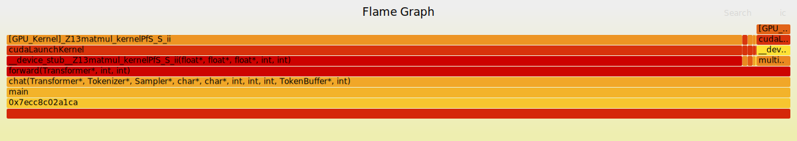

# eBPF by Example: Building a GPU Flamegraph Profiler with CUPTI

Have you ever wondered which part of your CPU code is responsible for launching a specific GPU kernel? CPU profilers can show you the host-side call stacks, but they lose visibility once the work is handed off to the GPU. On the other hand, GPU profilers detail what's happening on the device but often don't link it back to the specific CPU function that initiated it. This creates a blind spot, making it difficult to answer a critical question: "Which line of my code is causing this slow GPU kernel to run?"

This tutorial will guide you through building a profiler that bridges this gap. You will create a unified CPU-to-GPU flamegraph using the power of eBPF and NVIDIA's CUPTI (CUDA Profiling Tools Interface). By the end, you'll have a tool that captures CPU stack traces at the moment of a `cudaLaunchKernel()` call and intelligently stitches them together with the corresponding GPU kernel's execution data. The result is a powerful visualization that reveals exactly which host code paths are triggering which GPU kernels, allowing you to pinpoint performance bottlenecks without recompiling your application. We'll achieve this by using CUPTI's correlation IDs, which act as a bridge connecting CPU-side API calls with their GPU-side kernel executions.

## A Real-World Example: Profiling a Qwen3 LLM Inference

To see our profiler in action, let's look at a real-world example: profiling a Qwen3 0.6B Large Language Model during inference. The resulting flamegraph, shown below, visualizes the entire operation, merging CPU call stacks with the GPU kernels they launch. It immediately becomes clear that the `matmul_kernel` (matrix multiplication) is the most time-consuming part, accounting for 95% of the total GPU execution time.



**Key Insights from this Flamegraph:**

This visualization gives us a clear breakdown of where the GPU is spending its time:
- **`matmul_kernel`**: 3.1 seconds (95% of GPU time). This tells us that matrix multiplication is, by far, the biggest performance bottleneck.
- **`multi_head_attention_kernel`**: 105ms (3.2%). The attention mechanism adds a small amount of overhead.
- **`rmsnorm_kernel`**: 44ms (1.3%). Normalization is a relatively inexpensive operation.
- **End-to-End Visibility**: The flamegraph shows the complete call chain, from the `main` function on the CPU all the way to the specific `[GPU_Kernel]` executing on the device.

## The Magic Behind the Scenes: Injection and Correlation

So, how do we create this unified view? The process involves two key technologies working in tandem: eBPF for the CPU side and CUPTI for the GPU side.

1.  **GPU Tracing with CUPTI Injection**: We start by creating a small, custom CUPTI library. By setting the `CUDA_INJECTION64_PATH` environment variable, we tell the CUDA runtime to load our library alongside the application. Once loaded, this library uses the CUPTI API to record all GPU activities, such as kernel launches and memory transfers. Crucially, it captures timestamps and special **correlation IDs** for each event.

2.  **CPU Profiling with eBPF**: At the same time, we use an eBPF "uprobe" to monitor the application from the outside. This probe is attached to the `cudaLaunchKernel()` function within the CUDA runtime library. Whenever the application calls this function to launch a kernel, our eBPF program springs into action, capturing the complete CPU call stack at that exact moment.

3.  **Connecting the Dots**: After the application finishes running, we are left with two sets of data: a trace of GPU events from CUPTI and a collection of CPU stack traces from eBPF. A final script then merges them. It uses the **correlation IDs** from CUPTI to link a specific `cudaLaunchKernel` API call to the actual kernel that ran on the GPU. It then finds the corresponding CPU stack trace captured by eBPF (usually by matching timestamps) and appends the GPU kernel's name to it.

The result is a "folded" stack file, ready to be turned into a flamegraph, where each line represents a complete CPU-to-GPU call chain.

> You can find the complete source code for this tutorial here: <https://github.com/eunomia-bpf/bpf-developer-tutorial/tree/main/src/xpu/flamegraph>

## The Core Problem: Why Is Correlating CPU and GPU So Hard?

To understand why we need a special tool, it's important to grasp the fundamental challenge of GPU profiling. When you run a CUDA application, you're dealing with two distinct worlds operating in parallel: the **CPU** and the **GPU**.

-   **On the CPU side**, your application code makes calls to the CUDA runtime library (e.g., `cudaLaunchKernel`, `cudaMemcpy`). These calls don't execute the work directly; instead, they package up commands and send them to the GPU driver.
-   **On the GPU side**, the hardware picks up these commands and executes them. This involves launching kernels with thousands of threads, moving data, and performing computations.

The performance bottlenecks you want to find often live in the handoff between these two worlds. Traditional profilers struggle here. A CPU profiler (`perf`, for example) can tell you that your program spent a lot of time inside `cudaLaunchKernel`, but it can't tell you *which* kernel was launched or how long it actually ran on the GPU. Conversely, a GPU profiler (like NVIDIA's Nsight) will give you detailed metrics about a kernel's execution but won't show you the specific line of CPU code that caused it to run.

This disconnect is the problem we're solving. And it's not unique to NVIDIA. Whether you're using AMD's ROCm or Intel's Level Zero, the challenge of linking CPU-side causes to GPU-side effects is universal. The solution, regardless of the platform, is to find a way to "tag" a request on the CPU and find that same tag on the GPU.

Fortunately, NVIDIA's CUDA runtime provides exactly what we need: **correlation IDs**. Every time an API call like `cudaLaunchKernel` is made, the runtime assigns it a unique ID. This ID is passed along with the work to the GPU. Later, when the kernel executes, it carries the same ID. By capturing this ID on both sides, we can definitively link a CPU call stack to a GPU kernel execution. This is where CUPTI becomes essential, as it gives us access to these activity records. By injecting a CUPTI-based tracer into our application, we can harvest these events without having to recompile anything.

## Our Profiler's Architecture: eBPF + CUPTI Injection

Our profiler is built on a three-part architecture that combines eBPF, CUPTI, and a final merging step. Here’s how the pieces fit together:

1.  **The eBPF Profiler (CPU-Side Monitoring)**: This component acts as our CPU-side watchdog. It uses an eBPF **uprobe** to attach to the `cudaLaunchKernel` function inside the CUDA runtime library. Whenever any process on the system calls this function, our eBPF program triggers, instantly capturing the full CPU call stack with nanosecond precision. This gives us a snapshot of the exact code path—from the main function down to the specific loop or method—that initiated the GPU work.

2.  **The CUPTI Injection Library (GPU-Side Tracing)**: To see what the GPU is doing, we use a clever trick called library injection. We compile a small shared library that uses the CUPTI API. By setting the `CUDA_INJECTION64_PATH` environment variable, we instruct the CUDA runtime to load our library into the target application automatically. Once inside, it activates CUPTI's activity tracing, which records detailed events for kernel executions and runtime API calls. These records include high-precision timestamps and, most importantly, the **correlation IDs** that link everything together.

3.  **The Trace Merger (Connecting the Traces)**: After the profiling session ends, we have two raw data streams: CPU stack traces from eBPF and GPU activity records from CUPTI. The final step is to merge them. A script parses both traces and begins the correlation process. It first finds matching `cudaLaunchKernel` events between the two traces (using timestamps as a guide) and then uses the correlation ID from those events to link the CPU-side call to the correct GPU kernel execution. The output is a unified "folded stack" file, where each line looks something like this: `cpu_func1;cpu_func2;cudaLaunchKernel;[GPU_Kernel]kernel_name count`. This format is exactly what the standard `flamegraph.pl` script needs to generate the final visualization.

## Meet the Team: The Components of Our Profiler

Our profiling system is made up of four key components that work together to give us a complete picture of our application's performance. Let's get to know the role each one plays.

*   **The Conductor: `gpuperf.py`**
    This Python script is the main entry point and orchestrator of the entire profiling process. It's responsible for launching the target application with both the eBPF profiler and CUPTI tracer active. It sets up the necessary environment variables, starts and stops the tracers at the right time, and kicks off the final merge step to produce the unified flamegraph data. It also gracefully handles cleanup and offers different modes, allowing you to run a CPU-only, GPU-only, or a combined profile.

*   **The CPU Spy: The Rust eBPF Profiler (`profiler/`)**
    This is a high-performance stack trace collector built in Rust using the `libbpf` library. Its job is to spy on the CPU. It attaches an eBPF uprobe to the `cudaLaunchKernel` function in the CUDA runtime library. Every time this function is called, the profiler captures the full user-space stack trace, records a high-precision timestamp, and saves it in a special "extended folded format." This extended format is crucial because the timestamps are what allow us to later correlate these CPU events with GPU activity.

*   **The GPU Informant: The CUPTI Trace Injection Library (`cupti_trace/`)**
    This is a C++ shared library that acts as our informant on the inside. Loaded into the target application via `CUDA_INJECTION64_PATH`, it uses the CUPTI API to subscribe to GPU activities. It records detailed information about runtime API calls and kernel executions, including their start and end timestamps and their all-important **correlation IDs**. This library is designed to be non-intrusive; it collects data asynchronously and writes it to a trace file, all without requiring any changes to the original application.

*   **The Detective: The Trace Merger (`merge_gpu_cpu_trace.py`)**
    This Python script plays the role of the detective. After the profiling run is complete, it takes the CPU trace from our eBPF spy and the GPU trace from our CUPTI informant and pieces the story together. It intelligently matches the CPU stack traces to their corresponding GPU kernel executions using a two-step process: first by finding events that are close in time, and then by confirming the match using the correlation ID. Once a match is found, it appends the GPU kernel's name to the CPU stack trace and generates the final folded stack file, ready for visualization.

## A Deeper Look: How the Profiling Pipeline Works

To truly understand how our profiler works, let's follow the journey of a single `cudaLaunchKernel` call as it travels through our entire pipeline. From the moment you execute the `gpuperf.py` script to the final generation of the flamegraph, we'll trace the data flow and see how each component plays its part.

### The Three Pillars of Our Profiler

Our pipeline is built on three core technical implementations. Let's examine the key code snippets from each to understand how they function.

1.  **Capturing CPU Stacks with the eBPF Profiler (`profiler/src/bpf/profile.bpf.c`)**

    At the heart of our CPU-side monitoring is a lightweight eBPF program written in C. This program is compiled into highly efficient, native bytecode that runs directly in the kernel, ensuring minimal performance overhead. Unlike tools that interpret scripts at runtime, this `libbpf`-based approach is fast and safe. We use it to dynamically attach a uprobe to the `cudaLaunchKernel` function without having to modify any of NVIDIA's own binaries.

```c
// eBPF program that captures stack traces when cudaLaunchKernel is called
SEC("uprobe")
int uprobe_handler(struct pt_regs *ctx)
{
    struct stacktrace_event *event;

    // Reserve space in ring buffer for the event
    event = bpf_ringbuf_reserve(&events, sizeof(*event), 0);
    if (!event)
        return 1;

    // Capture process/thread info
    event->pid = bpf_get_current_pid_tgid() >> 32;
    event->cpu_id = bpf_get_smp_processor_id();
    event->timestamp = bpf_ktime_get_ns();  // Nanosecond timestamp
    bpf_get_current_comm(event->comm, sizeof(event->comm));

    // Capture kernel and user stack traces
    event->kstack_sz = bpf_get_stack(ctx, event->kstack, sizeof(event->kstack), 0);
    event->ustack_sz = bpf_get_stack(ctx, event->ustack, sizeof(event->ustack), BPF_F_USER_STACK);

    bpf_ringbuf_submit(event, 0);
    return 0;
}
```

When the `uprobe_handler` is triggered, it captures all the necessary information about the CPU-side call. It records the process and thread ID, grabs a nanosecond-precision timestamp, and, most importantly, uses the `bpf_get_stack()` helper to walk the user-space stack and capture the full call chain. This data is then efficiently sent from the kernel to our user-space Rust application via a BPF ring buffer.

Once in user space, the Rust profiler performs several key tasks. It receives the raw stack data, resolves the memory addresses to human-readable function names (a process called symbolization, done here with the `blazesym` library), and formats it all into our special "extended folded format."

A standard folded stack for a flamegraph looks like this: `stack1;stack2;stack3 1`. The `1` at the end is simply a count. Our extended format, enabled with the `-E` flag, adds crucial temporal and contextual information: `timestamp_ns comm pid tid cpu stack1;stack2;...;stackN`. This timestamp is the key that will unlock the correlation with the GPU trace data. It tells us *exactly when* the `cudaLaunchKernel` call happened, allowing us to match it with GPU events that occur microseconds or milliseconds later.

2.  **Spying on the GPU with the CUPTI Injection Library (`cupti_trace/cupti_trace_injection.cpp`)**

    Now for the GPU side. How do we see what the GPU is doing without modifying the application? We use a powerful feature of the CUDA driver called **library injection**. We create a small C++ shared library that acts as our GPU informant. By setting the `CUDA_INJECTION64_PATH` environment variable to point to our library, we tell the CUDA runtime to load it into the application's process space automatically.

    The magic happens because our library is loaded *before* the main CUDA runtime is fully initialized. This gives us the perfect opportunity to set up our spy gear. We use a `__attribute__((constructor))` function, which the Linux dynamic loader runs automatically when our library is loaded. Inside this constructor, we activate CUPTI and tell it which events we're interested in.

```cpp
// This function is automatically called when our library is loaded.
__attribute__((constructor))
void InitializeInjection(void)
{
    // Subscribe to CUPTI callbacks
    cuptiSubscribe(&subscriberHandle, CallbackHandler, NULL);

    // Enable activity tracing for kernels and runtime APIs
    cuptiActivityEnable(CUPTI_ACTIVITY_KIND_CONCURRENT_KERNEL);
    cuptiActivityEnable(CUPTI_ACTIVITY_KIND_RUNTIME);

    // Register our callback functions to handle the data buffers.
    // CUPTI will call `BufferRequested` when it needs memory to store data,
    // and `BufferCompleted` when a buffer is full and ready for processing.
    cuptiActivityRegisterCallbacks(BufferRequested, BufferCompleted);
}

// This callback is triggered by CUPTI whenever a buffer of activity records is full.
void CUPTIAPI BufferCompleted(CUcontext ctx, uint32_t streamId, uint8_t *buffer,
                               size_t size, size_t validSize)
{
    CUpti_Activity *record = NULL;

    // Iterate through all the activity records in the completed buffer.
    while (CUPTI_SUCCESS == cuptiActivityGetNextRecord(buffer, validSize, &record)) {
        switch (record->kind) {
            // This record type contains details about a GPU kernel's execution.
            case CUPTI_ACTIVITY_KIND_CONCURRENT_KERNEL: {
                CUpti_ActivityKernel4 *kernel = (CUpti_ActivityKernel4 *)record;

                // We extract the most important details: the kernel's name, its start and
                // end timestamps (from the GPU's own high-precision clock), and the
                // all-important correlation ID that links it back to a CPU-side API call.
                fprintf(outputFile, "CONCURRENT_KERNEL [ %llu, %llu ] duration %llu, \"%s\", correlationId %u\n",
                        kernel->start,           // GPU timestamp (ns)
                        kernel->end,             // GPU timestamp (ns)
                        kernel->end - kernel->start,
                        kernel->name,            // Kernel function name
                        kernel->correlationId);  // The link to the CPU API call!
                break;
            }
            // This record type contains details about a CUDA runtime API call.
            case CUPTI_ACTIVITY_KIND_RUNTIME: {
                CUpti_ActivityAPI *api = (CUpti_ActivityAPI *)record;

                // We only care about `cudaLaunchKernel` calls, as they are the ones
                // that launch the kernels we're tracking.
                if (api->cbid == CUPTI_RUNTIME_TRACE_CBID_cudaLaunchKernel_v7000) {
                    fprintf(outputFile, "RUNTIME [ %llu, %llu ] \"cudaLaunchKernel\", correlationId %u\n",
                            api->start,          // API entry timestamp
                            api->end,            // API exit timestamp
                            api->correlationId); // The same ID as the corresponding kernel.
                }
                break;
            }
        }
    }
}
```

As the target application runs, CUPTI works silently in the background, filling up memory buffers with detailed activity records. This process is highly efficient and asynchronous. When a buffer is full, CUPTI invokes our `BufferCompleted` callback, delivering a batch of events for us to process.

Inside this callback, we iterate through two important types of records:

1.  **`CUPTI_ACTIVITY_KIND_RUNTIME`**: This tells us whenever a CUDA runtime function was called, such as `cudaLaunchKernel`. We record its timestamp and, most importantly, the **correlation ID** that the CUDA runtime assigned to this specific call.

2.  **`CUPTI_ACTIVITY_KIND_CONCURRENT_KERNEL`**: This record is generated after a GPU kernel finishes executing. It contains a wealth of information, including the kernel's name, its precise start and end timestamps (measured by the GPU's own hardware clock), and the exact same **correlation ID** that we saw in the runtime API record.

This shared correlation ID is the entire key to our profiler. It's the "tag" that allows us to definitively prove that the `cudaLaunchKernel` call with ID `12345` on the CPU is directly responsible for the `matmul_kernel` execution with ID `12345` on the GPU. Our injection library simply writes these events out to a text file, creating a log of all GPU activity, ready for the final merging step.

3.  **The Detective Work: Merging Traces in `merge_gpu_cpu_trace.py`**

    After the profiling run is complete, we have two crucial pieces of evidence: a file of CPU stack traces from our eBPF profiler and a file of GPU activity from our CUPTI library. The final step is to bring them together to tell a single, coherent story. This is the job of our Python-based detective, the `TraceMerger`.

    The `TraceMerger` class is where the core correlation logic lives. It starts by parsing both trace files. The CPU trace is in our "extended folded format," with each line containing a nanosecond timestamp and a full call stack. The GPU trace contains all the `RUNTIME` and `CONCURRENT_KERNEL` events we logged.

    The script then performs a two-step matching process for every CPU stack trace it captured:

    1.  **Timestamp Matching**: For a given CPU stack captured at a specific nanosecond, it searches for a `cudaLaunchKernel` *runtime event* from the GPU trace that occurred at roughly the same time. We have to allow for a small time window (e.g., 10 milliseconds) because the CPU and GPU clocks aren't perfectly synchronized, and there can be small delays.

    2.  **Correlation ID Confirmation**: Once it finds a potential match based on time, it takes the correlation ID from that `cudaLaunchKernel` runtime event. It then searches for a *kernel execution event* that has the exact same correlation ID.

    If both steps succeed, we have a confirmed match! We now know that the CPU stack trace is directly responsible for that specific GPU kernel execution. The script then appends the GPU kernel's name to the CPU call stack, creating a unified view.

```python
class TraceMerger:
    def find_matching_kernel(self, cpu_stack: CPUStack) -> Optional[GPUKernelEvent]:
        """
        Correlates a CPU stack with a GPU kernel using our two-step matching process.
        """
        # Step 1: Find the cudaLaunchKernel runtime call that happened
        # closest in time to our CPU stack capture.
        best_launch = None
        min_time_diff = self.timestamp_tolerance_ns  # 10ms search window

        for launch in self.cuda_launches.values():
            time_diff = abs(cpu_stack.timestamp_ns - launch.start_ns)
            if time_diff < min_time_diff:
                min_time_diff = time_diff
                best_launch = launch

        if not best_launch:
            return None # No launch found within our time window.

        # Step 2: Use the correlation ID from the launch event to find the
        # exact GPU kernel that was executed.
        for kernel in self.gpu_kernels:
            if kernel.correlation_id == best_launch.correlation_id:
                return kernel  # Success! We found the matching kernel.

        return None

    def merge_traces(self):
        """
        Builds the final merged stacks, ready for the flamegraph script.
        Example: cpu_func1;cpu_func2;cudaLaunchKernel;[GPU_Kernel]kernel_name
        """
        for cpu_stack in self.cpu_stacks:
            merged_stack = cpu_stack.stack.copy()

            gpu_kernel = self.find_matching_kernel(cpu_stack)
            if gpu_kernel:
                # If a match is found, append the GPU kernel's name.
                merged_stack.append(f"[GPU_Kernel]{gpu_kernel.name}")
            else:
                # If no match is found, we still note that a launch was attempted.
                merged_stack.append("[GPU_Launch_Pending]")

            # Convert the final, merged stack into a string.
            stack_str = ';'.join(merged_stack)
            
            # This is the crucial step: weight the stack by the GPU kernel's
            # actual execution time in microseconds, not just a simple count.
            kernel_duration_us = int(gpu_kernel.end_us - gpu_kernel.start_us) if gpu_kernel else 0
            self.merged_stacks[stack_str] += kernel_duration_us
```

### The Importance of Duration Weighting

One of the most critical details in this entire process is how we generate the final data for the flamegraph. A standard flamegraph just counts how many times each unique stack trace appears. This is fine for CPU-only profiling, where every sample represents a roughly equal slice of time. But for our use case, it would be misleading.

A `cudaLaunchKernel` call might launch a kernel that runs for 2 microseconds or one that runs for 200 milliseconds. If we just counted them as "1" each, the flamegraph would incorrectly show them as having equal importance.

To solve this, we use **duration weighting**. Instead of adding `1` to the count for a matched stack, we add the GPU kernel's *actual execution duration in microseconds*.

-   `cpu_stack;...;[GPU_Kernel]fast_kernel 2` (ran for 2 µs)
-   `cpu_stack;...;[GPU_Kernel]slow_kernel 200000` (ran for 200,000 µs)

This ensures the width of the bars in the final flamegraph is proportional to the *actual time spent on the GPU*. A kernel that runs 1000x longer will appear 1000x wider, immediately and accurately drawing your eye to the real performance hotspots. Without this, you'd be flying blind, unable to distinguish truly expensive operations from trivial ones.

### Putting It All Together: Orchestration in `gpuperf.py`

The final piece of the puzzle is the `gpuperf.py` script, which acts as the conductor for our profiling orchestra. It's responsible for starting the tracers, running the target application, stopping the tracers, and kicking off the final merge and analysis. The order of operations is critical for everything to work correctly.

Let's look at the core logic in the `run_with_trace` function:

```python
def run_with_trace(self, command, cpu_profile, chrome_trace, merged_trace):
    # 1. Set up the environment for CUPTI injection. This tells the CUDA
    #    runtime where to find our custom tracer library.
    env = os.environ.copy()
    env['CUDA_INJECTION64_PATH'] = str(self.injection_lib)
    env['CUPTI_TRACE_OUTPUT_FILE'] = trace_file

    # 2. Start the eBPF CPU profiler *before* the target application.
    #    This is crucial because the uprobe must be attached and ready
    #    before the application makes its first CUDA call.
    self.start_cpu_profiler(cpu_output_file=cpu_profile)
    time.sleep(1.0)  # Give it a moment to ensure the uprobe is active.

    # 3. Launch the target application. The CUDA runtime will automatically
    #    load our injection library because of the environment variable we set.
    target_proc = subprocess.Popen(command, env=env)
    target_proc.wait()

    # 4. Once the application finishes, stop the CPU profiler and
    #    begin the final trace merging process.
    self.stop_cpu_profiler()
    self.generate_merged_trace(cpu_trace=cpu_profile, gpu_trace=chrome_trace,
                                output_file=merged_trace)
```

Here’s a step-by-step breakdown of the timeline:

1.  **Environment Setup**: The script first sets the `CUDA_INJECTION64_PATH` environment variable. This is an official feature of the CUDA driver that tells it to load a specific shared library into any application that initializes the CUDA runtime. This is the hook that lets our CUPTI tracer get inside the target process.

2.  **Start CPU Profiler First**: The script calls `start_cpu_profiler()` *before* launching the user's command. This is the most critical step in the orchestration. The eBPF profiler needs to attach its uprobe to the `cudaLaunchKernel` function in the `libcudart.so` library. If the application starts first, it might load the CUDA library and make calls before our probe is in place, causing us to miss events. By starting the profiler first (and adding a small sleep), we ensure our CPU spy is in position and ready to record from the very beginning.

3.  **Launch the Target**: With the environment set and the eBPF probe active, the script launches the target application using `subprocess.Popen`. As soon as the application makes its first CUDA call, the CUDA runtime initializes and, thanks to our environment variable, loads our `libcupti_trace_injection.so` library. At this point, both our CPU and GPU tracers are active and recording data.

4.  **Stop and Merge**: The script waits for the target application to complete. Once it's finished, it cleanly shuts down the eBPF profiler and then calls `generate_merged_trace()`. This function is the trigger for the `TraceMerger` detective, which begins the work of parsing, correlating, and weighting the data to produce the final, unified folded stack file.


## Putting It to the Test: Example Applications

Theory is great, but the best way to learn is by doing. To help you see the profiler in action and experiment with it yourself, this tutorial includes two different CUDA applications that you can build and profile.

### The Main Event: A Real LLM Inference Engine (`qwen3.cu`)

This is the recommended example and the one we used to generate the flamegraph at the beginning of this tutorial. `qwen3.cu` is a complete, self-contained CUDA implementation of the Qwen3 0.6B transformer model. It's not a simplified mock-up; it's a real Large Language Model that performs inference on the GPU.

Profiling this application gives you a realistic view of the workloads you'll encounter in modern AI. You'll see the interplay between the core components of a transformer architecture, including:
- Tokenization
- Multi-head attention layers
- Feedforward networks
- RMS normalization

This example is perfect for understanding how high-level concepts in a neural network translate into specific GPU kernels and where the true performance bottlenecks lie in a real-world AI application.

### A Simpler Starting Point: The Mock Transformer Simulator (`mock-test/llm-inference.cu`)

If you want a simpler, lightweight test case, the `mock-test/llm-inference.cu` application is a great alternative. It simulates the computational patterns of a transformer model (like matrix multiplications and other typical operations) but does so without the overhead of loading a large model's weights. This makes it quick to compile and run, providing a straightforward way to verify that all the components of your profiling stack are working correctly before moving on to more complex workloads.

## Let's Get Building: Compilation and Execution

Now that you understand the architecture, it's time to get your hands dirty. This section will walk you through compiling all the necessary components of our profiling stack: the CUPTI injection library, the Rust eBPF profiler, and the example applications. We'll then run the full profiler to generate our first unified flamegraph.

### Step 1: Build the CUPTI Injection Library

First, we need to compile our GPU informant—the C++ shared library that uses CUPTI to trace GPU activities. This library will be injected into our target application to report back on what the GPU is doing.

Navigate to the `cupti_trace` directory and use the provided `Makefile` to build the library:

```bash
cd cupti_trace
make
```

This command compiles `cupti_trace_injection.cpp` into a shared library file named `libcupti_trace_injection.so`. The `Makefile` is designed to automatically locate your CUDA installation (it checks common paths like `/usr/local/cuda-12.x` and `/usr/local/cuda-13.x`) and links against the necessary CUPTI and CUDA runtime libraries.

Once the compilation is finished, verify that the shared library has been created:

```bash
ls -lh libcupti_trace_injection.so
```

You should see a new file, typically around 100-120KB in size. If the compilation fails, the most common reasons are:
- The CUDA Toolkit is not installed on your system.
- The `nvcc` compiler is not in your system's `PATH`.
- The `CUPTI` development files are missing (they are usually included with the CUDA Toolkit under `extras/CUPTI/`).

### Step 2: Build the Rust eBPF Profiler

Next, we'll build the CPU spy—our high-performance eBPF profiler written in Rust. This tool is responsible for capturing the CPU-side stack traces whenever `cudaLaunchKernel` is called.

Navigate to the `profiler` directory and use `cargo` to compile the application. We'll build it in `--release` mode to ensure it runs with maximum performance and minimal overhead.

```bash
cd profiler
cargo build --release
```

This command does two important things:
1.  It compiles the Rust user-space application, which manages the eBPF probes and processes the data.
2.  It also compiles the C-based eBPF program (`profile.bpf.c`) into BPF bytecode and embeds it directly into the final Rust executable. This creates a self-contained binary that's easy to distribute and run.

After the build completes, verify that the profiler executable is ready:

```bash
ls -lh target/release/profile
```

You can also run it with the `--help` flag to see the available command-line options:

```bash
./target/release/profile --help
```

You should see a list of options, including `--uprobe` (which we'll use to specify the `cudaLaunchKernel` function) and `-E` (which enables the "extended folded output" format with nanosecond timestamps). The final binary will be around 2-3MB, as it includes not only our code but also the powerful `blazesym` library for fast, offline stack symbolization.

### Step 3: Build the Mock LLM Application

With our profiling tools compiled, we now need a target application to profile. We'll start with the simpler of the two examples: the mock LLM simulator. This lightweight CUDA application is perfect for a quick test to ensure all parts of our profiler are working together correctly.

Navigate to the `mock-test` directory and compile the application using its `Makefile`:

```bash
cd mock-test
make
```

This command uses `nvcc`, the NVIDIA CUDA compiler, to build the `llm-inference.cu` source file into an executable named `llm-inference`. The `Makefile` includes a few useful flags:
- `-std=c++17`: Enables modern C++ features.
- `--no-device-link`: Creates a single, self-contained executable, which simplifies compilation.
- `-Wno-deprecated-gpu-targets`: Suppresses warnings you might see if you're using a newer CUDA toolkit with a slightly older GPU.

Verify that the compilation was successful by listing the file:

```bash
ls -lh llm-inference
```

The resulting binary should be small, around 200KB. You can run it directly to see it in action. By default, it runs a continuous simulation for 10 seconds, so you can stop it early with `Ctrl+C` after a few moments.

```bash
./llm-inference
# The application will start printing output...
# Press Ctrl+C after a few seconds to stop it.
```

### Step 4: Build the Real LLM Inference Application

Now for the main event: compiling the `qwen3.cu` application. This is a real, self-contained LLM inference engine that runs the Qwen3 0.6B model. Profiling this will give you a fantastic, real-world view of a modern AI workload.

First, navigate to the `qwen3.cu` directory.

```bash
cd qwen3.cu
```

Before you can compile the code, you need to download the model weights. The `Makefile` provides a convenient target for this.

```bash
# This will download the 3GB FP32 model file
make download-model
```

Next, compile the application. There's a critical detail here: for our eBPF uprobe to work, the application must dynamically link against the CUDA runtime library (`libcudart.so`). If it's statically linked, the `cudaLaunchKernel` symbol won't be available in a shared library for our probe to find. The `Makefile` has a specific target, `runcu`, that handles this for you.

```bash
# Compile the application with dynamic linking
make runcu
```

To be absolutely sure it's linked correctly, you can use the `ldd` command to inspect the executable's dependencies.

```bash
ldd runcu | grep cudart
# The output should look something like this:
# libcudart.so.12 => /usr/local/cuda-12.9/lib64/libcudart.so.12
```

If you see a line showing that `runcu` is linked to `libcudart.so`, you're all set! All the components are now built and ready for action.

### Time to Shine: Running the Profiler

With all the components built, you're now ready to run the full profiling stack and see it in action! The `gpuperf.py` script is your central command hub. It seamlessly orchestrates the eBPF profiler, the CUPTI injection, and the final trace merging, giving you a complete, end-to-end view of your application's performance.

Let's profile the real LLM inference workload using the Qwen3 model. The following command tells `gpuperf.py` to run the `runcu` executable and trace its execution:

```bash
# Profile real LLM inference (Qwen3 model)
sudo timeout -s 2 10 python3 gpuperf.py \
    -c qwen3_gpu.json \
    -p qwen3_cpu.txt \
    -m qwen3_merged.folded \
    bash -c 'cd qwen3.cu && ./runcu Qwen3-0.6B-FP32.gguf -q "Explain eBPF" -r 1'
```

Let's break down this command to understand what each part does:
- `sudo`: Required because the eBPF profiler needs elevated privileges to attach probes to the kernel and other processes.
- `timeout -s 2 10`: A useful utility that runs the command for a maximum of 10 seconds. It sends an interrupt signal (`-s 2`, which is `SIGINT` or `Ctrl+C`) to gracefully stop the process. This is perfect for capturing a short, representative sample of a long-running application.
- `python3 gpuperf.py`: Our main orchestration script.
- `-c qwen3_gpu.json`: Specifies the output file for the GPU trace data, which will be saved in the Chrome Trace JSON format.
- `-p qwen3_cpu.txt`: Specifies the output file for the CPU stack traces, saved in our extended folded format.
- `-m qwen3_merged.folded`: The grand prize! This is the output file for the final, merged, and duration-weighted folded stacks.
- `bash -c '...'`: The command to be profiled. We use `bash -c` to ensure that we first change into the `qwen3.cu` directory before executing the `runcu` application.

As the script runs, you'll see a detailed log of its progress:

```
CUPTI trace output will be written to: /home/yunwei37/workspace/bpf-developer-tutorial/src/xpu/flamegraph/gpu_results.txt
Starting CPU profiler with cudaLaunchKernel hook
  CUDA library: /usr/local/cuda-12.9/lib64/libcudart.so.12
  Output: /home/yunwei37/workspace/bpf-developer-tutorial/src/xpu/flamegraph/qwen3_cpu.txt
Running command with GPU profiling: bash -c cd qwen3.cu && ./runcu Qwen3-0.6B-FP32.gguf -q "What is eBPF?" -r 1
Trace output: /home/yunwei37/workspace/bpf-developer-tutorial/src/xpu/flamegraph/gpu_results.txt
Started target process with PID: 3861826
A: E BPF stands for "Extended Bounded Performance" and is a system designed to allow users to create custom user-space programs...
tok/s: 54.489164

Stopping CPU profiler...
CPU profile saved to: /home/yunwei37/workspace/bpf-developer-tutorial/src/xpu/flamegraph/qwen3_cpu.txt

Converting trace to Chrome format: qwen3_gpu.json
Parsed 185867 events

Chrome trace file written to: qwen3_gpu.json

Generating merged CPU+GPU trace: qwen3_merged.folded
Parsing CPU uprobe trace (extended folded format): qwen3_cpu.txt
Parsed 92732 CPU stack traces from cudaLaunchKernel hooks
Found 1 unique threads
Parsing GPU CUPTI trace: qwen3_gpu.json
Parsed 92732 GPU kernel events
Parsed 92732 cudaLaunchKernel runtime events
Correlating CPU stacks with GPU kernels...
  Thread (3861826, 3861826): Using sequential matching (92732 events)
Matched 92732 CPU stacks with GPU kernels
Total unique stacks: 7
Wrote 7 unique stacks (3265164 total samples)
✓ Merged trace generated: qwen3_merged.folded
```

The output is a goldmine of information. Let's analyze the key statistics:
- **92,732 CPU stack traces captured**: This means that during the 10-second run, the `cudaLaunchKernel` function was called over 92,000 times. Our eBPF profiler caught every single one.
- **185,867 total GPU events**: The CUPTI tracer recorded a huge amount of activity, including kernel launches, memory copies, and other runtime events.
- **100% Correlation Rate**: The line `Matched 92732 CPU stacks with GPU kernels` is the most important one. It confirms that our correlation logic worked perfectly, successfully linking every single CPU-side launch event to its corresponding GPU-side kernel execution.
- **7 unique stacks**: Although there were over 92,000 calls, they all originated from just 7 unique code paths in the application.
- **3,265,164 total samples**: This is the sum of all GPU kernel durations in microseconds. It tells us that the total time spent executing kernels on the GPU during this run was approximately 3.27 seconds.

This successful run leaves us with three valuable trace files (`qwen3_cpu.txt`, `qwen3_gpu.json`, and `qwen3_merged.folded`), which we'll use in the next steps to visualize and inspect the performance data.

### Step 5: Generate the Flamegraph

After a successful profiling run, you're left with the `qwen3_merged.folded` file. This is the culmination of our data collection and correlation efforts, containing all the information needed to build our unified CPU+GPU flamegraph. To turn this data into a beautiful and interactive visualization, we use the classic `flamegraph.pl` script, a powerful Perl program created by Brendan Gregg, the performance engineering expert who pioneered the use of flamegraphs.

This repository includes a convenient wrapper script, `combined_flamegraph.pl`, which is based on the original and tailored for our needs. Let's use it to generate our SVG file:

```bash
./combined_flamegraph.pl qwen3_merged.folded > qwen3_flamegraph.svg
```

This command reads the duration-weighted folded stacks from `qwen3_merged.folded` and outputs a scalable vector graphics (SVG) file named `qwen3_flamegraph.svg`.

Now, open the newly created SVG file in any modern web browser to explore it:

```bash
firefox qwen3_flamegraph.svg
# or
google-chrome qwen3_flamegraph.svg
```

#### Navigating Your Interactive Flamegraph

Welcome to your unified performance profile! The flamegraph you see is a powerful tool for understanding your application's behavior. Here’s how to interpret it:
- **The Y-Axis is the Call Stack**: Each vertical level represents a function in the call stack. The function at the bottom (`main`) calls the one above it, and so on, all the way up to the final functions that launch the GPU kernels.
- **The X-Axis is Time**: The width of each rectangle (or "frame") is directly proportional to the total time it spent on the GPU. Because we used duration weighting, a kernel that ran for 200ms will have a frame that is 100 times wider than a kernel that ran for 2ms. This immediately draws your attention to the most expensive parts of your code.
- **Interactivity is Key**:
    - **Hover**: Move your mouse over any frame to see its full function name, the total time it consumed (in microseconds), and what percentage of the total execution time it represents.
    - **Click to Zoom**: Click on any frame to "zoom in" on it. The flamegraph will redraw to show only the call stacks that pass through that function, making it easy to analyze specific parts of your application.
- **Color is Random**: The colors are chosen randomly to help distinguish adjacent frames. They don't have any specific meaning.

#### Analyzing the Qwen3 LLM Flamegraph

When you explore the `qwen3_flamegraph.svg`, you're looking at the real computational fingerprint of a transformer model. You'll be able to trace the execution from the `main` function, through the `chat()` and `forward()` loops, all the way to the specific GPU kernels.

You will likely notice a few dominant kernels that make up the vast majority of the graph's width:
- **`_Z13matmul_kernel...` (Matrix Multiplication)**: This will be the widest block by a large margin, consuming around 3.1 seconds (95%) of the GPU time. This is the heart of a transformer's feed-forward networks and is the primary computational bottleneck.
- **`_Z27multi_head_attention_kernel...` (Multi-Head Attention)**: This kernel, responsible for the attention mechanism, will be the next largest, but significantly smaller than matrix multiplication (around 105ms, or 3.2%).
- **`_Z14rmsnorm_kernel...` (RMS Normalization)**: These kernels are even smaller, showing that normalization is a relatively cheap operation in this model.

This visualization provides an immediate, intuitive understanding of where your program's time is going. It proves that for this LLM, optimizing the matrix multiplication operations would yield the biggest performance gains.

### Going Deeper: Inspecting the Raw Trace Files

While the flamegraph gives you a fantastic high-level overview, sometimes you need to get your hands on the raw data to answer specific questions. Our profiler generates three distinct trace files, each offering a different lens through which to view your application's performance. Let's explore what each one contains and how you can use it.

#### 1. The CPU-Side Story: `qwen3_cpu.txt`

This file contains the raw output from our Rust eBPF profiler. It's a log of every single time the `cudaLaunchKernel` function was called, captured in our special "extended folded format."

You can peek at the first few lines using `head`:
```bash
head -5 qwen3_cpu.txt
```

The output will look something like this:
```
1761680628903821454 runcu 3861826 3861826 1 _start;__libc_start_main;0x70c45902a1ca;main;chat(...);forward(Transformer*, int, int);__device_stub__Z12accum_kernelPfS_i(...);cudaLaunchKernel
1761680628903827398 runcu 3861826 3861826 1 _start;__libc_start_main;0x70c45902a1ca;main;chat(...);forward(Transformer*, int, int);__device_stub__Z13matmul_kernelPfS_S_ii(...);cudaLaunchKernel
1761680628903830126 runcu 3861826 3861826 1 _start;__libc_start_main;0x70c45902a1ca;main;chat(...);forward(Transformer*, int, int);__device_stub__Z13matmul_kernelPfS_S_ii(...);cudaLaunchKernel
...
```

Each line is a complete snapshot of a single event, broken down as follows:
- `1761680628903821454`: The nanosecond timestamp when the event occurred.
- `runcu`: The command name of the process.
- `3861826`: The process ID (PID).
- `3861826`: The thread ID (TID).
- `1`: The CPU core where the event was captured.
- `_start;__libc_start_main;...;cudaLaunchKernel`: The full, semicolon-delimited user-space call stack.

This file is a treasure trove of information on its own. You can see the exact sequence of kernel launches and the CPU code paths that led to them. You could even generate a CPU-only flamegraph from this file to see which parts of your host code are responsible for calling the CUDA API most frequently.

#### 2. The GPU-Side Story: `qwen3_gpu.json`

This file contains the detailed GPU activity trace from our CUPTI injection library, conveniently formatted as a JSON file that can be loaded into the Chrome Trace Viewer. This gives you a powerful timeline visualization of everything that happened on the GPU.

Take a look at the beginning of the file:
```bash
head -20 qwen3_gpu.json
```

You'll see a standard JSON structure. To make sense of it, open Google Chrome and navigate to `chrome://tracing`. Click the "Load" button and select your `qwen3_gpu.json` file.

The timeline view you'll see is invaluable for understanding the dynamics of GPU execution. You can:
- **See Parallelism**: Visually identify when multiple kernels are running concurrently on different CUDA streams.
- **Spot Bubbles**: Find gaps in the timeline where the GPU was idle, which might indicate CPU-side bottlenecks or inefficient data loading.
- **Analyze Memory Transfers**: See how long `cudaMemcpy` operations are taking and whether they are blocking kernel execution.

#### 3. The Unified Story: `qwen3_merged.folded`

This is the final, merged output that we used to generate our flamegraph. It represents the successful correlation of our CPU and GPU traces.

Let's examine its contents:
```bash
cat qwen3_merged.folded
```

The output shows the unique, combined call stacks and their total weighted durations:
```
0x70c45902a1ca;main;chat(Transformer*, Tokenizer*, Sampler*, char*, char*, int, int, int, TokenBuffer*, int);forward(Transformer*, int, int);__device_stub__Z12accum_kernelPfS_i(float*, float*, int);cudaLaunchKernel;[GPU_Kernel]_Z12accum_kernelPfS_i 29
0x70c45902a1ca;main;chat(...);forward(Transformer*, int, int);__device_stub__Z13matmul_kernelPfS_S_ii(float*, float*, float*, int, int);cudaLaunchKernel;[GPU_Kernel]_Z13matmul_kernelPfS_S_ii 3099632
0x70c45902a1ca;main;chat(...);forward(Transformer*, int, int);__device_stub__Z14rmsnorm_kernelPfS_S_ii(float*, float*, float*, int, int);cudaLaunchKernel;[GPU_Kernel]_Z14rmsnorm_kernelPfS_S_ii 22119
0x70c45902a1ca;main;chat(...);forward(Transformer*, int, int);multi_head_attention(...);__device_stub__Z27multi_head_attention_kerneliiPfS_S_S_S_iiii(...);cudaLaunchKernel;[GPU_Kernel]_Z27multi_head_attention_kerneliiPfS_S_S_S_iiii 105359
```

This format is simple but powerful. Each line consists of two parts:
1.  A semicolon-delimited string representing a full call stack, starting from the CPU, going through `cudaLaunchKernel`, and ending with the name of the GPU kernel that was executed (e.g., `[GPU_Kernel]_Z13matmul_kernel...`).
2.  A number at the end representing the total time in **microseconds** that this specific call stack spent executing on the GPU.

For example, the line ending in `3099632` tells us that the call stack leading to the `matmul_kernel` was responsible for a total of 3,099,632 microseconds (or 3.1 seconds) of GPU compute time. This duration weighting is the key to creating a flamegraph that accurately reflects where time is truly being spent, making it an indispensable tool for performance analysis.

## The Road Ahead: Limitations and Future Directions

You've successfully built a powerful profiler that provides incredible insight into CPU-GPU interactions. However, like any tool, it has its limitations. Understanding these boundaries is key to using the profiler effectively and seeing the exciting possibilities for future development.

### What Our Profiler Doesn't Tell You: Inside the Kernel

Our profiler excels at showing you *which* CPU code launches *which* GPU kernel and for *how long* that kernel runs. If your flamegraph shows a kernel consuming 50ms, you've found a hotspot. But it doesn't tell you *why* it's slow. Is the kernel memory-bound, waiting on data from VRAM? Is it compute-bound, with all its math units saturated? Or is it suffering from thread divergence, where threads within the same warp take different code paths?

To answer these questions, you need to go a level deeper with **kernel-internal profiling**. This is the domain of specialized tools like **NVIDIA Nsight Compute** or **Nsight Systems**. These profilers can instrument the GPU at the hardware level, collecting metrics on warp occupancy, instruction throughput, and memory latency. The typical workflow is to use our flamegraph profiler first to identify the most time-consuming kernels, and then use Nsight Compute to perform a deep-dive analysis on those specific kernels to optimize their internal performance.

An alternative approach to achieve fine-grained GPU observability is to run eBPF programs directly on the GPU. This is the direction explored by the eGPU paper and [bpftime GPU examples](https://github.com/eunomia-bpf/bpftime/tree/master/example/gpu). `bpftime` converts eBPF bytecode to PTX instructions that GPUs can execute, then dynamically patches CUDA binaries at runtime to inject these eBPF programs at kernel entry/exit points. This enables observing GPU-specific information like block indices, thread indices, global timers, and warp-level metrics. Developers can instrument critical paths inside GPU kernels to measure execution behavior and diagnose complex performance issues that kernel-side tracing cannot reach. This GPU-internal observability complements kernel tracepoints - together they provide end-to-end visibility from API calls through kernel drivers to GPU execution.

### The Next Frontier: Building a Unified, System-Wide Profiler

This tutorial provides a powerful foundation, but the journey doesn't end here. The next evolution is to build a production-grade, continuous profiler that offers a truly holistic view of system performance. This involves moving beyond just correlating CPU calls and GPU kernels to understanding the "why" behind performance bottlenecks and scaling to complex, real-world workloads.

The future of this work is being developed at **[eunomia-bpf/xpu-perf](https://github.com/eunomia-bpf/xpu-perf)**, an open-source project aimed at creating an online, continuous profiler for both CPU and GPU. Here are the key directions being explored:

*   **From "What" to "Why": Deep Kernel and Instruction-Level Analysis**
    Our current profiler tells you *what* kernel ran and for *how long*. The next step is to understand *why* it was slow. This requires diving into the GPU hardware itself.
    -   **Instruction-Level Stalls**: Using advanced features in vendor libraries like **NVIDIA CUPTI** or technologies like the Intel GPU Observability Architecture (OA) found in tools like **iaprof**, we can capture the specific reasons for stalls within the GPU's execution units. This means identifying bottlenecks caused by memory latency (waiting for data), ALU contention, or other hardware limitations and attributing them back to the exact shader instructions responsible.
    -   **Hardware Performance Counters**: By sampling hardware performance counters on the GPU, we can collect detailed metrics on cache hit rates, memory bandwidth, and warp occupancy, providing a rich, data-driven picture of in-kernel performance.

*   **A Holistic System View: Combining On-CPU, Off-CPU, and GPU Data**
    A process has many states, and a complete profiler must capture all of them.
    -   **On-CPU vs. Off-CPU**: Our current eBPF profiler focuses on "on-CPU" activity. A complete solution would also trace "off-CPU" time, showing you not just what the CPU was doing, but why it was *waiting*. Was it blocked on I/O, a lock, or, most relevantly, waiting for a GPU kernel to complete?
    -   **Unified Flamegraphs**: By merging on-CPU, off-CPU, and GPU traces, we can create a single, system-wide flamegraph. This would visualize the entire lifecycle of a request, showing time spent in active CPU computation, time spent waiting for the GPU, and time spent executing on the GPU, all in one seamless view.

*   **Scaling to Production Workloads: Multi-GPU and Multi-Stream Support**
    Modern AI and HPC workloads are rarely confined to a single GPU or a single stream. A production-ready profiler must handle this complexity.
    -   **Multi-GPU Awareness**: The profiler should be able to distinguish between different GPUs, tagging events with a device ID (e.g., `[GPU0_Kernel]name` vs. `[GPU1_Kernel]name`). This enables the analysis of load balancing and helps identify issues specific to one device in a multi-GPU setup.
    -   **Multi-Stream Correlation**: For applications using multiple CUDA streams for concurrent execution, the correlation logic must be enhanced. This involves tracking stream IDs for both CPU launch calls and GPU kernel executions to correctly attribute work in complex, out-of-order scenarios.

By integrating these advanced capabilities, we can build a next-generation observability tool that provides unparalleled, end-to-end insight into the performance of accelerated applications. The work on `xpu-perf` aims to make this vision a reality.

## Tying It All Together: Your Journey in Review

Congratulations! You've successfully navigated the complex world of CPU-GPU performance analysis. The fundamental challenge in profiling modern accelerated applications is bridging two distinct domains: the CPU, which submits work, and the GPU, which executes it. In this tutorial, you built a complete, end-to-end profiling solution that does exactly that.

Let's recap the powerful stack you've assembled:
-   An **eBPF Profiler**, built in Rust, that uses uprobes to capture CPU stack traces with nanosecond precision at the exact moment `cudaLaunchKernel` is called.
-   A **CUPTI Injection Library**, which seamlessly loads into any CUDA application to record detailed GPU activity, complete with the crucial correlation IDs that link GPU work back to its CPU origin.
-   A **Python-based Trace Merger**, which acts as a detective, intelligently stitching the CPU and GPU traces together using timestamps and correlation IDs. It produces a duration-weighted folded stack file, ensuring the final visualization accurately reflects real-world execution time.

The result is a unified flamegraph that provides an intuitive, end-to-end view of your application's execution, from the highest-level CPU functions down to the specific kernels running on the GPU.

The beauty of this approach is its power and flexibility. It works without recompiling your target application, supports any framework built on CUDA (including PyTorch, TensorFlow, and JAX), and has a low enough overhead to be used in production environments. The tools are modular, allowing you to use the eBPF profiler for CPU-only analysis, the CUPTI tracer for a GPU timeline, or combine them for unparalleled insight.

You are now equipped with the techniques and tools to diagnose performance bottlenecks in complex machine learning workloads, scientific simulations, or any GPU-accelerated application where understanding the intricate dance between the CPU and GPU is the key to unlocking performance.

> We hope this tutorial has been an empowering step in your developer journey. To continue learning and exploring the world of eBPF, check out our full collection of tutorials at <https://github.com/eunomia-bpf/bpf-developer-tutorial> or visit our website at <https://eunomia.dev/tutorials/>. Happy profiling!


## References

### Related GPU Profiling Tools

1. AI Flame Graphs / iaprof (Intel) provides hardware-sampling driven GPU and software stack flamegraphs (EU stalls, kernels, and CPU stacks), open-sourced in 2025. This is deeper than our tutorial: it samples inside GPU kernels and attributes stall reasons back to code context. Use this when you need hardware stall analysis and an end-to-end view. [Brendan Gregg](https://www.brendangregg.com/blog/2024-10-29/ai-flame-graphs.html) | [GitHub](https://github.com/intel/iaprof)

2. Nsight Systems and Nsight Compute (NVIDIA) are official tools. Systems gives CPU to GPU timelines and API/kernels; Compute gives in-kernel metrics and roofline-style analyses. Ideal for deep tuning, not always for low-overhead continuous profiling. [NVIDIA Docs](https://docs.nvidia.com/nsight-systems/UserGuide/index.html)

3. PyTorch Profiler / Kineto (NVIDIA/Meta, also AMD/Intel backends) records CPU ops and GPU kernels via CUPTI and shows them in TensorBoard/Chrome Trace. It supports CPU to accelerator flow links ("ac2g"). Great when you're already in PyTorch. [PyTorch Blog](https://pytorch.org/blog/automated-trace-collection/) | [PyTorch Docs](https://pytorch.org/docs/stable/profiler.html)

4. HPCToolkit (Rice) provides low-overhead call-path profiling that can attribute GPU kernel time to CPU calling context, and on NVIDIA can use PC sampling to examine instruction-level behavior. Powerful for production runs and cross-vendor GPUs. [Argonne Leadership Computing Facility](https://www.alcf.anl.gov/sites/default/files/2024-11/HPCToolkit-ALCF-2024-10.pdf)

5. AMD ROCm (rocprofiler-SDK) offers HIP/HSA tracing with Correlation_Id to connect async calls and kernels. If you want an AMD version of this tutorial, integrate with rocprofiler events. [ROCm Documentation](https://rocm.docs.amd.com/projects/rocprofiler-sdk/en/docs-6.3.1/how-to/using-rocprofv3.html)

6. Level Zero tracer (Intel) allows you to intercept Level Zero API calls (loader tracing) and build a similar correlator with L0 callbacks for Intel GPUs. [Intel Docs](https://www.intel.com/content/www/us/en/docs/oneapi/optimization-guide-gpu/2023-1/level-zero-tracer.html)

7. Perfetto / Chrome Trace viewer is your choice for viewing `.json` timelines. Perfetto is the modern web UI that reads Chromium JSON traces (what your CUPTI converter emits). [Perfetto](https://perfetto.dev/)

### Technical Documentation

1. NVIDIA CUPTI Documentation: <https://docs.nvidia.com/cupti/Cupti/index.html>
2. CUPTI Activity API: <https://docs.nvidia.com/cupti/Cupti/r_main.html#r_activity_api>
3. CUPTI ActivityKernel8 Structure: <https://docs.nvidia.com/cupti/api/structCUpti__ActivityKernel8.html>
4. CUDA Profiling Guide: <https://docs.nvidia.com/cuda/profiler-users-guide/>
5. Nsight Systems User Guide: <https://docs.nvidia.com/drive/drive-os-5.2.6.0L/nsight-systems/pdf/UserGuide.pdf>
6. eBPF Stack Trace Helpers: <https://github.com/iovisor/bcc/blob/master/docs/reference_guide.md#4-bpf_get_stackid>
7. Chrome Trace Format: <https://docs.google.com/document/d/1CvAClvFfyA5R-PhYUmn5OOQtYMH4h6I0nSsKchNAySU>
8. Flamegraph Visualization: <https://www.brendangregg.com/flamegraphs.html>

### Advanced Topics

1. bpftime GPU eBPF: <https://github.com/eunomia-bpf/bpftime/tree/master/example/gpu>
2. iaprof Intel GPU Profiling Analysis: <https://eunomia.dev/blog/2025/10/11/understanding-iaprof-a-deep-dive-into-aigpu-flame-graph-profiling/>
3. Tutorial Repository: <https://github.com/eunomia-bpf/bpf-developer-tutorial/tree/main/src/xpu/flamegraph>

Complete source code including the eBPF profiler, CUPTI injection library, trace merger, and test applications is available in the tutorial repository. Contributions and issue reports welcome!
